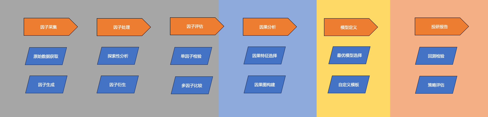
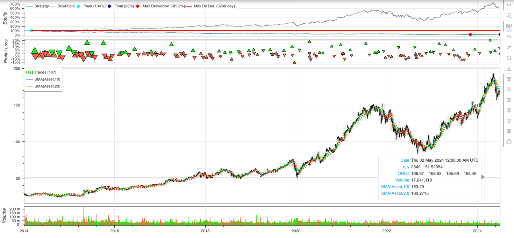
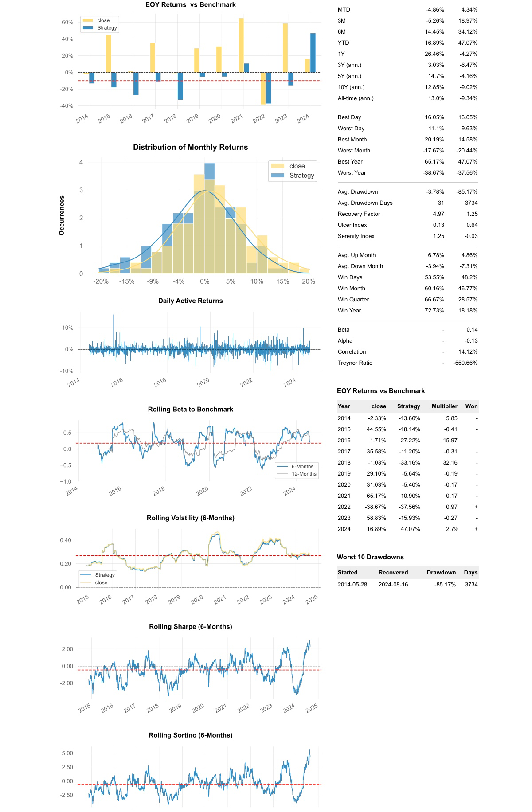
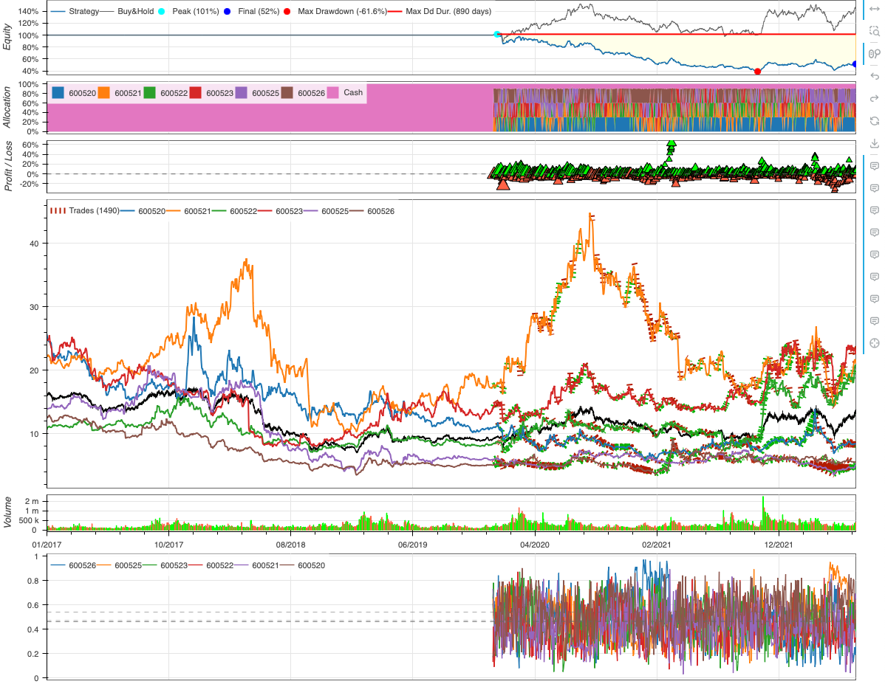

## trade-learn：使用 Python 搭建机器学习交易策略

trade-learn 是一个基于 alphalens、backtesting.py、pyfolio 和 quantstats 的机器学习策略研发工具包，提供因子采集、因子处理、因子评估、因果分析、模型定义和策略回测的全套策略研发流程，并支持可视化结果以 html 文件进行存档分享。



可视化图汇总：


## 主要特性

1. 提供「通达信交易软件」的股票行情，以及配套的 30 个经验证的技术指标 tdx30，可直接对标通达信平台使用。 
2. 提供「tradingview」的股票行情，最大程度利用 tradingview 的数据可视化的优势，快速得到灵感并进行验证。 
3. 提供「雅虎财经」的股票行情，以及相应的因子计算公式，包括 WorldQuant LLC 的 alpha101 和 alpha191 因子集合。
4. 提供「探索性分析」和「最优模型选择」工具，迅速预览数据集的规律，以及常见模型在数据集的性能表现。
5. 提供「因果图构建」和「因果特征选择」算法，扩展 gplearn 的函数库，实现面向时序数据进行「特征衍生」。
6. 内嵌美国量化交易平台 quantopian 开源的策略研发组件，如 empyrical、alphalens、pyfolio 工具包。 
7. 优化 backtesting.py 回测框架，在原来仅支持单标的策略搭建的基础上，额外增加了投资组合策略搭建的解决方案。 
8. 在整个策略搭建过程，除了模型需要用户自定义外，无需再引入其余第三方包，形成机器学习策略搭建的流程闭环。

## 下载方法
需科学上网：
```bash
pip install trade-learn
```
推荐（更加实时）：
```bash
pip install git+https://github.com/MuuYesen/trade-learn.git@master
```

## 使用模板
```python
from tradelearn.query import Query
from tradelearn.strategy.backtest import Backtest, Strategy
from tradelearn.strategy.evaluate import Evaluate

if __name__ == '__main__':

    # 从 tradingview 中得到标的行情数据
    GOOG = Query.history_ohlc(engine='tv', symbol='GOOG', exchange='NASDAQ')

    def crossover(series1, series2):
        return series1[-2] < series2[-2] and series1[-1] > series2[-1]

    # 编写策略类
    class SmaCross(Strategy):
        fast = 10
        slow = 20

        # 计算策略需要使用的指标数据
        def init(self):
            def SMA(arr, n):
                return arr.rolling(n).mean()
            
            price = self.data.close.df
            self.ma1 = self.I(SMA, price, self.fast, overlay=True)
            self.ma2 = self.I(SMA, price, self.slow, overlay=True)

        # 根据指标得到交易信号，并进行买卖
        def next(self):
            
            if crossover(self.ma1, self.ma2):
                self.position().close()
                self.buy()
            elif crossover(self.ma2, self.ma1):
                self.position().close()
                self.sell()

    # 运行回测并绘制结果
    bt = Backtest(GOOG, SmaCross, cash=1000000, commission=.002, trade_on_close=False)
    stats = bt.run()
    bt.plot(plot_volume=True, superimpose=True)

    # 分析回测结果
    Evaluate.analysis_report(stats, GOOG, engine='quantstats')
```
```
Start                     2014-03-27 00:00:00
End                       2024-08-16 00:00:00
Duration                   3795 days 00:00:00
Exposure Time [%]                   98.509174
Equity Final [$]                233497.861225
Equity Peak [$]                1043778.801501
Return [%]                         -76.650214
Buy & Hold Return [%]              529.083876
Return (Ann.) [%]                  -13.163701
Volatility (Ann.) [%]               24.393102
Sharpe Ratio                        -0.539648
Sortino Ratio                       -0.680248
Calmar Ratio                        -0.154556
Max. Drawdown [%]                    -85.1713
Avg. Drawdown [%]                    -85.1713
Max. Drawdown Duration     3734 days 00:00:00
Avg. Drawdown Duration     3734 days 00:00:00
# Trades                                  146
Win Rate [%]                        33.561644
Best Trade [%]                      20.325583
Worst Trade [%]                    -15.835971
Avg. Trade [%]                      -0.991343
Max. Trade Duration         116 days 00:00:00
Avg. Trade Duration          26 days 00:00:00
Profit Factor                        0.702201
Expectancy [%]                      -0.808854
SQN                                 -2.538763
Kelly Criterion                     -0.272909
_strategy                            SmaCross
_equity_curve                             ...
_trades                        EntryBar  E...
_orders                              Ticke...
_positions                {'Asset': -1154,...
_trade_start_bar                           19
```



## 更多例子

**使用机器学习模型进行投资组合的搭建**：  
```python
from tradelearn.query import Query
from tradelearn.strategy.backtest import Backtest, Strategy

import pandas as pd
from sklearn.ensemble import RandomForestClassifier


if __name__ == '__main__':
    
    # 定义随机森林指标类，使用预测的方式得到交易信号并构建投资组合回测
    class RandomForest(Strategy):
        def init(self):
            # 获取原始数据与特征集
            data = self.data.df.swaplevel(0, 1, axis=1).stack().reset_index(level=1)
            fea_list = data.columns.drop(['label', 'code']).tolist()

            # 划分训练集并训练模型
            train_data = data.query(f"date >= '{tn_begin_date}' and date < '{bt_begin_date}'")
            bt_x_train, bt_y_train = train_data[fea_list], train_data['label']
            model = RandomForestClassifier(random_state=42, n_jobs=-1)
            model.fit(bt_x_train, bt_y_train)

            # 预测投资组合在回测期间的每个标的涨跌概率
            test_data = data.query(f"date >= '{bt_begin_date}' and date < '{bt_end_date}'")
            ind_df = pd.DataFrame({'date': data.index.unique()}).set_index('date')
            for symbol in test_data['code'].unique():
                bt_x_test = test_data.query(f"code == '{symbol}'")[fea_list]
                pre_proba = model.predict_proba(bt_x_test)[:, 1]
                ind_df = pd.merge(pd.DataFrame(pre_proba, index=bt_x_test.index, columns=[symbol]),
                                  ind_df, on=['date'], how='right')

            # 将涨跌概率包装成指标，用于 next 方法
            self.proba = self.I(ind_df, overlay=False)

        def next(self):
            # 重置投资组合的持仓权重
            self.alloc.assume_zero()

            # 得到当天的各标的预测概率
            proba = self.proba.df.iloc[-1]

            # 根据概率指标进行标的数量的筛选，同时设置持仓权重分配
            bucket = self.alloc.bucket['equity']
            bucket.append(proba.sort_values(ascending=False))
            bucket.trim(limit=3)
            bucket.weight_explicitly(weight=1/3)
            bucket.apply(method='update')

            # 更新投资组合持仓权重
            self.rebalance(cash_reserve=0.1)


    # 定义数据起始日期和结束日期
    tn_begin_date = '2017-01-01'
    tn_end_date = '2022-06-22'

    # 循环查询多只股票的历史数据并进行处理
    rawdata = None
    for i in range(7):
        temp = Query.history_ohlc(symbol='60052' + str(i), start=tn_begin_date, end=tn_end_date, adjust='hfq', engine='tdx')
        if temp is None:
            continue

        # 标记涨跌标签
        temp['label'] = temp['close'].pct_change(periods=1).shift(-1).map(lambda x: 1 if x > 0 else -1)
        rawdata = pd.concat([rawdata, temp], axis=0)

    # 将数据集转换格式，并进行缺失值处理
    btdata = rawdata.pivot_table(index='date', columns='code').swaplevel(0, 1, axis=1)
    btdata = btdata.sort_values(by='code', axis=1).fillna(method='ffill')

    # 定义回测起始日期和结束日期
    bt_begin_date = '2020-01-01'
    bt_end_date = '2022-06-22'

    # 运行回测并绘制结果, 基准默认是等权持仓
    bt = Backtest(btdata, RandomForest, cash=1000000, commission=.002, trade_on_close=False)
    bt.run()
    bt.plot(plot_volume=True, superimpose=False, plot_allocation=True)
```
```
Start                     2017-01-03 00:00:00
End                       2022-06-21 00:00:00
Duration                   1995 days 00:00:00
Exposure Time [%]                    44.83798
Equity Final [$]                 515002.86814
Equity Peak [$]                 1014662.65544
Return [%]                         -48.499713
Buy & Hold Return [%]               44.762561
Return (Ann.) [%]                  -24.465092
Volatility (Ann.) [%]               23.349782
Sharpe Ratio                        -1.047765
Sortino Ratio                       -1.083421
Calmar Ratio                        -0.397371
Max. Drawdown [%]                  -61.567329
Avg. Drawdown [%]                  -15.734656
Max. Drawdown Duration      890 days 00:00:00
Avg. Drawdown Duration      225 days 00:00:00
# Trades                                 1490
Win Rate [%]                        47.919463
Best Trade [%]                      63.422669
Worst Trade [%]                    -34.094076
Avg. Trade [%]                      -0.150202
Max. Trade Duration          98 days 00:00:00
Avg. Trade Duration           8 days 00:00:00
Profit Factor                        1.040877
Expectancy [%]                       0.082296
SQN                                 -1.906885
Kelly Criterion                     -0.116659
_strategy                        RandomForest
_equity_curve                             ...
_trades                         EntryBar  ...
_orders                               Tick...
_positions                {'600520': 0, '6...
_trade_start_bar                          731
dtype: object
```


## 方法指南
### 原始数据获取
```python
from tradelearn.query import Query

rawdata = Query.history_ohlc(symbol='600520', start='2017-01-01', end='2022-06-22', adjust='hfq',engine='tdx')
```
| 参数名称   | 数据类型   | 备注                                             |
|--------|--------|------------------------------------------------|
| symbol | string | 目标股票的编号                                        |
| start  | string | 开始日期                                           |
| end    | string | 结束日期                                           |
| adjust | string | 复权方式，可选择前复权和后复权，分别对应 'qfq' 和 'hfq'             |
| engine | string | 第三方数据源，可选择雅虎财经或通达信平台，分别对应 'yahoo'、'tv' 和 'tdx' |

### 因子生成
```python
from tradelearn.query import Query

res = Query.alphas101(stock_data=rawdata, alpha_name=['alpha001'])
res = Query.alphas191(stock_data=rawdata, alpha_name=['alpha001'])
res = Query.tec_indicator(stock_data=rawdata, alpha_name=['ATR', 'RSI'])
```
| 参数名称       | 数据类型      | 备注                                            |
|------------|-----------|-----------------------------------------------|
| stock_data | DataFrame | 标的行情数据，要求具有 open、low、high、close、volume、vwap 列 |
| alpha_name | list      | 因子或者指标的名称列表                                   |

### 探索性分析
```python
from tradelearn.strategy.preprocess.explore import Explore

Explore.analysis_report(data=rawdata, filename='res/explore.html')
```

| 参数名称     | 数据类型      | 备注                 |
|----------|-----------|--------------------|
| data     | DataFrame | 标的行情数据             |
| filename | string    | html 文件的保存路径及名称，可选 |
### 因子衍生
```python
from tradelearn.strategy.preprocess.derive import Derive

res = Derive.generic_generate(data=rawdata, f_col=None, n_alpha=20, random_status=None)
```
| 参数名称    | 数据类型      | 备注                                                      |
|---------|-----------|---------------------------------------------------------|
| data    | DataFrame | 标的行情数据                                                  |
| f_col   | list      | 参与因子衍生的变量名称集合，默认使用除 code、date 和 label 之外的所有变量，并采用夏普指标评估 |
| n_alpha | int       | 最终因子衍生的数量                                               |
| random_status | int       | 随机数种子，如果不设置的话，每次执行都会出现不同的结果                             |
### 单因子检验
```python
from tradelearn.strategy.examine import Examine

Examine.single_factor(data=data, col='alpha001_101', filename='res/examine.html')
```
| 参数名称     | 数据类型      | 备注                        |
|----------|-----------|---------------------------|
| data     | DataFrame | 标的行情数据，要求具有两个及以上的股票       |
| col      | string    | 目标因子名称                    |
| filename | string    | html 文件的保存路径及名称，可选        |
### 多因子比较
```python
from tradelearn.strategy.examine import Examine

res = Examine.factor_compare(data=data, f_col=None, ind=None, cir=None)
```
| 参数名称  | 数据类型      | 备注                                              |
|-------|-----------|-------------------------------------------------|
| data  | DataFrame | 标的行情数据，要求具有两个及以上的股票                             |
| f_col | string    | 需要进行比较的因子名称列表，当值为 None 时选择开头为 'alpha' 前缀的所有变量进行比较 |
| ind   | string    | 所属行业字段的名称，用于计算 t 检验，可选                          |
| cir   | string    | 市值数据字段的名称，用于计算 t 检验，可选                          |
### 因果特征选择
```python
from tradelearn.causal.blanket import Blanket

Blanket.fit_causal(data=rawdata, method='iamb', target_name='volume', is_discrete=False)
```
| 参数名称        | 数据类型      | 备注                                |
|-------------|-----------|-----------------------------------|
| data        | DataFrame | 标的行情数据                            |
| method      | string    | 选用的因果特征选择算法，可选方法有 'iamb' 和 'pcmb' |
| target      | string    | 因变量名称                             |
| alpha       | float     | 置信度水平，一般设置成 0.05 或 0.01           |
| is_discrete | bool      | data 数据是离散型变量，则设置为 True           |
### 因果图构建
```python
from tradelearn.causal.graph import Graph

Graph.fit_causal(data=rawdata, method='pc', is_discrete=False, filename='res/pc.png')
```
| 参数名称        | 数据类型      | 备注                        |
|-------------|-----------|---------------------------|
| data        | DataFrame | 标的行情数据                    |
| method      | string    | 选用的因果图构建算法，可选方法有 'pc' 和 'ges' |
| is_discrete | bool      | data 数据是离散型变量，则设置为 True   |
| filename    | string    | 因果图的保存路径及名称，可选            |
### 最优模型选择
```python
from tradelearn.automl import AutoML

model = AutoML.lazy_predict(data=data)
```
| 参数名称     | 数据类型      | 备注                |
|----------|-----------|-------------------|
| data     | DataFrame | 标的行情数据            |
### 回测检验
```python
from tradelearn.strategy.backtest import Backtest

bt = Backtest(data=data, strategy=Example, cash=1000000, commission=.002, trade_on_close=False)
```
| 参数名称        | 数据类型      | 备注                          |
|-------------|-----------|-----------------------------|
| data        | DataFrame | 标的行情数据                      |
| strategy    | Strategy  | 策略类实现，需由用户自定义               |
| cash        | DataFrame | 回测初始金额                      |
| commission   | DataFrame | 单笔交易手续费                     |
| trade_on_close  | string    | 是否使用昨日收盘价进行买入，若是否则使用第二天的开盘价 |

### 策略评估
```python
from tradelearn.strategy.evaluate import Evaluate

Evaluate.analysis_report(strat=res, baseline=baseline, filename='./evaluate.html', engine='quantstats')
```
| 参数名称        | 数据类型      | 备注                                                      |
|-------------|-----------|---------------------------------------------------------|
| strat | dict      | LongBacktest.run() 返回的数据字典                              |
| baseline  | DataFrame | 基准行情数据                                                  |
| filename    | string    | 生成的 html 文件的路径及名称，可选                                    |
| engine   | string    | 回测结果评估，可选择 pyfolio 或 quantstats，分别对应 'pyfolio' 和 'quantstats' |
## 致谢

- [Quantopian](https://github.com/quantopian)
- [Trevor Stephens](https://github.com/trevorstephens)
- [PyWhy](https://github.com/py-why)
- [dodid](https://github.com/dodid)
- [DolphinDB](https://github.com/dolphindb)
- [happydasch](https://github.com/happydasch)
- [mpquant](https://github.com/mpquant)
- [baobao1997](https://github.com/baobao1997)

## 联系方式

微信公众号：知守溪的收纳屋  &nbsp;&nbsp;&nbsp;&nbsp;&nbsp;&nbsp;&nbsp;&nbsp;&nbsp; 电子邮箱：muyes88@gmail.com

