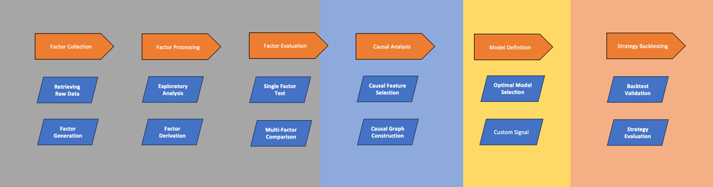

## trade-learn：A closed-loop for Building Trading Strategies in Python with Machine Learning

<b>trade-learn</b> is a machine learning strategy development toolkit based on alphalens, backtrader, pyfolio, and quantstats. It provides a <b>complete strategy development process</b>.

The functions it gives including factor collection, factor processing, factor evaluation, <b>causal analysis</b>, model definition, and strategy backtesting, and supports visualization results saved as <b>HTML files</b> for sharing.



Summary of visualizations:


## Key Features

1. Provides stock market data from "Tongdaxin Trading Software" along with 30 proven technical indicators (tdx30) that can be used directly with the Tongdaxin platform.
2. Offers stock market data from "TradingView," leveraging its advanced data visualization to quickly generate and validate trading insights.
3. Includes stock market data from "Yahoo Finance" and factor calculation formulas, such as the alpha101 and alpha191 factor sets from WorldQuant LLC.
4. Provides tools for "Exploratory Analysis" and "Optimal Model Selection" to rapidly identify patterns in the dataset and assess the performance of various models.
5. Features algorithms for "Causal Graph Construction" and "Causal Feature Selection," extending the gplearn library to support "Feature Derivation" for time series data.
6. Integrates open-source strategy development components from the Quantopian platform, including tools like empyrical, alphalens, and pyfolio.
7. Enhances the backtesting.py framework to support portfolio strategy development in addition to single-asset strategies.
8. Ensures a closed-loop process for machine learning strategy development by eliminating the need for additional third-party packages beyond the user-customized model.

## Download
Requires VPN:
```bash
pip install trade-learn
```
Recommended (for the latest version):
```bash
pip install git+https://github.com/MuuYesen/trade-learn.git@master
```

## Usage Template
```python
from tradelearn.query import Query
from tradelearn.strategy.backtest import Backtest, Strategy
from tradelearn.strategy.evaluate import Evaluate

if __name__ == '__main__':

    # Obtain asset market data from TradingView
    GOOG = Query.history_ohlc(engine='tv', symbol='GOOG', exchange='NASDAQ')

    def crossover(series1, series2):
        return series1[-2] < series2[-2] and series1[-1] > series2[-1]

    # Define the strategy class
    class SmaCross(Strategy):
        fast = 10
        slow = 20

        # Compute the indicator data needed for the strategy
        def init(self):
            def SMA(arr, n):
                return arr.rolling(n).mean()
            
            price = self.data.close.df
            self.ma1 = self.I(SMA, price, self.fast, overlay=True)
            self.ma2 = self.I(SMA, price, self.slow, overlay=True)

        # Generate trading signals based on the indicators and execute trades
        def next(self):
            
            if crossover(self.ma1, self.ma2):
                self.position().close()
                self.buy()
            elif crossover(self.ma2, self.ma1):
                self.position().close()
                self.sell()

    # Run the backtest and plot the results
    bt = Backtest(GOOG, SmaCross, cash=1000000, commission=.002, trade_on_close=False)
    stats = bt.run()
    bt.plot(plot_volume=True, superimpose=True)

    # Analyze the backtest results
    Evaluate.analysis_report(stats, GOOG, engine='quantstats')
```
```
Start                     2014-03-27 00:00:00
End                       2024-08-16 00:00:00
Duration                   3795 days 00:00:00
Exposure Time [%]                   98.509174
Equity Final [$]                233497.861225
Equity Peak [$]                1043778.801501
Return [%]                         -76.650214
Buy & Hold Return [%]              529.083876
Return (Ann.) [%]                  -13.163701
Volatility (Ann.) [%]               24.393102
Sharpe Ratio                        -0.539648
Sortino Ratio                       -0.680248
Calmar Ratio                        -0.154556
Max. Drawdown [%]                    -85.1713
Avg. Drawdown [%]                    -85.1713
Max. Drawdown Duration     3734 days 00:00:00
Avg. Drawdown Duration     3734 days 00:00:00
# Trades                                  146
Win Rate [%]                        33.561644
Best Trade [%]                      20.325583
Worst Trade [%]                    -15.835971
Avg. Trade [%]                      -0.991343
Max. Trade Duration         116 days 00:00:00
Avg. Trade Duration          26 days 00:00:00
Profit Factor                        0.702201
Expectancy [%]                      -0.808854
SQN                                 -2.538763
Kelly Criterion                     -0.272909
_strategy                            SmaCross
_equity_curve                             ...
_trades                        EntryBar  E...
_orders                              Ticke...
_positions                {'Asset': -1154,...
_trade_start_bar                           19
```


## Further Example

**Using machine learning models to build a portfolio**：  
```python
from tradelearn.query import Query
from tradelearn.strategy.backtest import Backtest, Strategy

import pandas as pd
from sklearn.ensemble import RandomForestClassifier


if __name__ == '__main__':
    
    # Define a RandomForest indicator class, using predictions to generate trading signals and conduct portfolio backtesting
    class RandomForest(Strategy):
        def init(self):
            # Obtain the raw data and feature set
            data = self.data.df.swaplevel(0, 1, axis=1).stack().reset_index(level=1)
            fea_list = data.columns.drop(['label', 'code']).tolist()

            # Split the training set and train the model
            train_data = data.query(f"date >= '{tn_begin_date}' and date < '{bt_begin_date}'")
            bt_x_train, bt_y_train = train_data[fea_list], train_data['label']
            model = RandomForestClassifier(random_state=42, n_jobs=-1)
            model.fit(bt_x_train, bt_y_train)

            # Predict the probability of price increases for each asset in the portfolio during the backtesting period
            test_data = data.query(f"date >= '{bt_begin_date}' and date < '{bt_end_date}'")
            ind_df = pd.DataFrame({'date': data.index.unique()}).set_index('date')
            for symbol in test_data['code'].unique():
                bt_x_test = test_data.query(f"code == '{symbol}'")[fea_list]
                pre_proba = model.predict_proba(bt_x_test)[:, 1]
                ind_df = pd.merge(pd.DataFrame(pre_proba, index=bt_x_test.index, columns=[symbol]),
                                  ind_df, on=['date'], how='right')

            # Package the probability predictions as indicators for use in the next method
            self.proba = self.I(ind_df, overlay=False)

        def next(self):
            # Reset the portfolio's position weights
            self.alloc.assume_zero()

            # Get the predicted probabilities for each asset on the current day
            proba = self.proba.df.iloc[-1]

            # Select a subset of assets based on the probability indicator and set position weights
            bucket = self.alloc.bucket['equity']
            bucket.append(proba.sort_values(ascending=False))
            bucket.trim(limit=3)
            bucket.weight_explicitly(weight=1/3)
            bucket.apply(method='update')

            # Update the portfolio's position weights
            self.rebalance(cash_reserve=0.1)


    # Define the start and end dates for the data
    tn_begin_date = '2017-01-01'
    tn_end_date = '2022-06-22'

    # Loop through multiple stocks to query historical data and process it
    rawdata = None
    for i in range(7):
        temp = Query.history_ohlc(symbol='60052' + str(i), start=tn_begin_date, end=tn_end_date, adjust='hfq', engine='tdx')
        if temp is None:
            continue

        # Label the data with price change tags
        temp['label'] = temp['close'].pct_change(periods=1).shift(-1).map(lambda x: 1 if x > 0 else -1)
        rawdata = pd.concat([rawdata, temp], axis=0)

    # Convert the dataset format and handle missing values
    btdata = rawdata.pivot_table(index='date', columns='code').swaplevel(0, 1, axis=1)
    btdata = btdata.sort_values(by='code', axis=1).fillna(method='ffill')

    # Define the start and end dates for the backtest
    bt_begin_date = '2020-01-01'
    bt_end_date = '2022-06-22'

    # Run the backtest and plot the results, with the default benchmark being an equal-weighted portfolio
    bt = Backtest(btdata, RandomForest, cash=1000000, commission=.002, trade_on_close=False)
    bt.run()
    bt.plot(plot_volume=True, superimpose=False, plot_allocation=True)
```
```
Start                     2017-01-03 00:00:00
End                       2022-06-21 00:00:00
Duration                   1995 days 00:00:00
Exposure Time [%]                    44.83798
Equity Final [$]                 515002.86814
Equity Peak [$]                 1014662.65544
Return [%]                         -48.499713
Buy & Hold Return [%]               44.762561
Return (Ann.) [%]                  -24.465092
Volatility (Ann.) [%]               23.349782
Sharpe Ratio                        -1.047765
Sortino Ratio                       -1.083421
Calmar Ratio                        -0.397371
Max. Drawdown [%]                  -61.567329
Avg. Drawdown [%]                  -15.734656
Max. Drawdown Duration      890 days 00:00:00
Avg. Drawdown Duration      225 days 00:00:00
# Trades                                 1490
Win Rate [%]                        47.919463
Best Trade [%]                      63.422669
Worst Trade [%]                    -34.094076
Avg. Trade [%]                      -0.150202
Max. Trade Duration          98 days 00:00:00
Avg. Trade Duration           8 days 00:00:00
Profit Factor                        1.040877
Expectancy [%]                       0.082296
SQN                                 -1.906885
Kelly Criterion                     -0.116659
_strategy                        RandomForest
_equity_curve                             ...
_trades                         EntryBar  ...
_orders                               Tick...
_positions                {'600520': 0, '6...
_trade_start_bar                          731
dtype: object
```


## Method Guide
### Retrieving Raw Data
```python
from tradelearn.query import Query

rawdata = Query.history_ohlc(symbol='600520', start='2017-01-01', end='2022-06-22', adjust='hfq',engine='tdx')
```
| Parameter Name   | Data Type	   | Notes                                                                                                                |
|--------|--------|----------------------------------------------------------------------------------------------------------------------|
| symbol | string | Stock ticker                                                                                                         |
| start  | string | Start date                                                                                                           |
| end    | string | End date                                                                                                             |
| adjust | string | Adjustment method, can choose forward or backward adjustment, corresponding to 'qfq' and 'hfq' respectively          |
| engine | string | Third-party data source, can choose Yahoo Finance or Tongdaxin, corresponding to 'yahoo'、'tv' and 'tdx' respectively |

### Factor Generation
```python
from tradelearn.query import Query

res = Query.alphas101(stock_data=rawdata, alpha_name=['alpha001'])
res = Query.alphas191(stock_data=rawdata, alpha_name=['alpha001'])
res = Query.tec_indicator(stock_data=rawdata, alpha_name=['ATR', 'RSI'])
```
| Parameter Name       | Data Type	      | Notes                                            |
|------------|-----------|-----------------------------------------------|
| stock_data | DataFrame | Target market data, required to have columns: open, low, high, close, volume, vwap |
| alpha_name | list      | List of factor or indicator names                                   |

### Exploratory Analysis
```python
from tradelearn.strategy.preprocess.explore import Explore

Explore.analysis_report(data=rawdata, filename='res/explore.html')
```

| Parameter Name     | Data Type	      | Notes                 |
|----------|-----------|--------------------|
| data     | DataFrame | Target market data             |
| filename | string    | Path and name of the saved HTML file, optional |
### Factor Derivation
```python
from tradelearn.strategy.preprocess.derive import Derive

res = Derive.generic_generate(data=rawdata, f_col=None, n_alpha=20, random_status=None)
```
| Parameter Name     | Data Type	      | Notes                                                                                                                                          |
|----------|-----------|------------------------------------------------------------------------------------------------------------------------------------------------|
| data     | DataFrame | Target market data                                                                                                                             |
| f_col   | list      | List of variable names derived from participating factors, and evaluated by Sharpe metrics. default to all variables except code, date, and label |
| n_alpha | int       | Count derived from the final factor                                                                                                            |
| random_status | int       | Random number seed, if not set, each execution will appear different results                          |
### Single Factor Test
```python
from tradelearn.strategy.examine import Examine

Examine.single_factor(data=data, col='alpha001_101', filename='res/examine.html')
```
| Parameter Name     | Data Type	      | Notes                        |
|----------|-----------|---------------------------|
| data     | DataFrame | Target market data, required to have two or more stocks       |
| col      | string    | Target factor name                    |
| filename | string    | Path and name of the saved HTML file, optional        |
### Multi-Factor Comparison
```python
from tradelearn.strategy.examine import Examine

res = Examine.factor_compare(data=data, f_col=None, ind=None, cir=None)
```
| Parameter Name  | Data Type	      | Notes                                 |
|-------|-----------|------------------------------------|
| data  | DataFrame | Target market data, required to have two or more stocks                |
| f_col | string    | List of factor names to compare, if None, all variables will be compared |
| ind   | string    | Industry field name for t-test calculation, optional             |
| cir   | string    | Market capitalization field name for t-test calculation, optional             |
### Causal Feature Selection
```python
from tradelearn.causal.blanket import Blanket

Blanket.fit_causal(data=rawdata, method='iamb', target_name='volume', is_discrete=False)
```
| Parameter Name        | Data Type	      | Notes                                |
|-------------|-----------|-----------------------------------|
| data        | DataFrame | Target market data                            |
| method      | string    | Selected causal feature selection algorithm, options are 'iamb' and 'pcmb' |
| target      | string    | Dependent variable name                             |
| alpha       | float     | Confidence level, generally set to 0.05 or 0.01           |
| is_discrete | bool      | If data is discrete, set to True           |
### Causal Graph Construction

```python
from tradelearn.causal.graph import Graph

Graph.fit_causal(data=rawdata, method='pc', is_discrete=False, filename='res/pc.png')
```
| Parameter Name        | Data Type      | Notes                        |
|-------------|-----------|---------------------------|
| data        | DataFrame | Target market data                    |
| method      | string    | Selected causal graph construction algorithm, options are 'pc' and 'ges' |
| is_discrete | bool      | If data is discrete, set to True   |
| filename    | string    | Path and name of the saved causal graph, optional            |
### Optimal Model Selection

```python
from tradelearn.automl import AutoML

model = AutoML.lazy_predict(data=data)
```
| Parameter Name     | Data Type	      | Notes                |
|----------|-----------|-------------------|
| data     | DataFrame | Target market data            |
### Backtest Validation

```python
from tradelearn.strategy.backtest import Backtest

bt = Backtest(data=data, strategy=Example, cash=1000000, commission=.002, trade_on_close=False)
```
| Parameter Name        | Data Type	      | Notes                        |
|-------------|-----------|---------------------------|
| data | DataFrame | Asset market data |
| strategy | Strategy | Strategy class implementation, needs to be customized by the user |
| cash | DataFrame | Initial amount for backtesting |
| commission | DataFrame | Transaction fee per trade | 
| trade_on_close | string | Whether to use the previous day's closing price for buying; if not, the next day's opening price is used |
### Strategy Evaluation

```python
from tradelearn.strategy.evaluate import Evaluate

Evaluate.analysis_report(strat=res, baseline=baseline, filename='./evaluate.html', engine='quantstats')
```
| Parameter Name        | Data Type	      | Notes                                                      |
|-------------|-----------|---------------------------------------------------------|
| strat | dict      | Data dictionary returned by LongBacktest.run()                              |
| baseline  | DataFrame | Baseline market data                                                  |
| filename    | string    | Path and name of the generated HTML file, optional                                    |
| engine   | string    | Evaluation engine, options are pyfolio or quantstats, corresponding to 'pyfolio' and 'quantstats' respectively |
## Acknowledgements

- [Quantopian](https://github.com/quantopian)
- [Trevor Stephens](https://github.com/trevorstephens)
- [PyWhy](https://github.com/py-why)
- [dodid](https://github.com/dodid)
- [DolphinDB](https://github.com/dolphindb)
- [happydasch](https://github.com/happydasch)
- [mpquant](https://github.com/mpquant)
- [baobao1997](https://github.com/baobao1997)

## Contact Information

WeChat Official Account：知守溪的收纳屋  &nbsp;&nbsp;&nbsp;&nbsp;&nbsp;&nbsp;&nbsp;&nbsp;&nbsp; Email：muyes88@gmail.com

