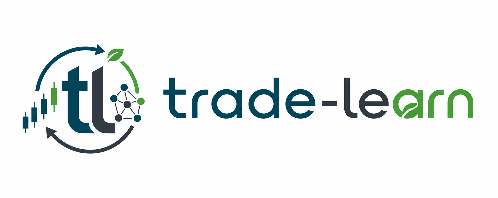
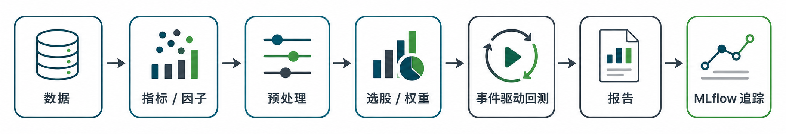

<p align="center">
  
</p>

<p align="center">
  <strong>Python で戦略と投資研究を、Rust でイベント驱动型バックテストエンジンを。</strong>
</p>

<p align="center">
  
  
  
  
</p>

<p align="center">
  <a href="./README.md">中文版</a> | <a href="./README_en.md">English</a>
</p>

**trade-learn** は、**trade**（取引）と **learn**（学習）を単一のパイプラインに統合したクオンツフレームワークです。インデックス強化、クオンツ研究、機械学習戦略、およびイベント駆動型バックテスト向けに設計されています。Python は戦略の表現、ファクター研究、モデル実験の柔軟性を提供し、Rust は注文マッチング、ポートフォリオ計算、イベントループといった高頻度バックテストコアを担います。研究、バックテストからレポート作成、実験追跡まで、すべてが再現可能な単一のワークフローを中心に展開されます。

このフレームワークが解決する核心的な課題は、単なる「バックテストの実行方法」ではなく、断片化された投資研究のセグメントをどのようにして完全な戦略ライフサイクルへと織りなすかという点にあります。

<p align="center">
  
</p>

## 実現パス

trade-learn は単純な機能の積み重ねではなく、「専門的な深み」と「開発効率」を繋ぐ架け橋を構築します。下層の **Engine** は Backtrader のセマンティクスと高度に同期しており、論理的な正確さを保証します。一方、上層の **Lite** は Pythonic でミニマリストなインターフェースを提供します。両者は高性能な Runtime を共有しており、「速度」と「精度」の完璧な統一を実現しています。

開発段階に応じて、戦略の「厚み」を自由に定義できます：
- **Engine モード (高度な開発)**: Backtrader のセマンティクスと完全に同期し、Analyzer/Sizer/Signal の完全なエコシステムをサポートします。論理的に精密で、非常に細かい粒度を持つ本番級の複雑なシステムの構築に適しています。
- **Lite モード (アジャイル検証)**: backtesting.py のミニマリズムを継承し、モデルの重み（Weights）との直接連携をサポートします。ファクターマイニング段階での高頻度なイテレーションやプロトタイプ検証に最適です。

TDX、TA-Lib、TradingView などの主要なインジケーターライブラリとシームレスに互換性があるだけでなく、ファクター研究に **因果推断 (Causal Inference)** を革新的に導入しています。内蔵の `CausalSelector` を通じて、特徴量選定、パラメータ最適化、バックテストレポートを有機的に結合し、クローズドループで透明かつ効率的なクオンツ投資研究パイプラインを提供します。

## 主要なハイライト

#### ⚡️ 高性能コア：Rust による極限のパフォーマンス
- **Rust ハイブリッド動力**: マッチングエンジンとコア計算は Rust で実装されており、単一銘柄で **28倍**、多資産のリバランスで **110倍以上**（対 Backtrader 比）の加速を提供します。
- **自動 Runner スケジューリング**: データの形状に応じて、「シングルストリーム逐次 Bar」または「パネル一括」を自動的に選択します。**インデックス強化シナリオ向けにメモリレイアウトを最適化**しており、開発者は `next()` のロジックのみに集中できます。

#### 🛡️ 厳格な金融工学：Backtrader セマンティクス 100% 同期
- **Engine 級の同期**: Analyzer / Sizer / Signal 体系を完全にサポートし、取引ログが Backtrader Oracle と論理的にゼロ差異であることを保証します。
- **Lite のミニマリズム表現**: 同一の Runtime 上に構築された軽量な構文。**内蔵の `target_weights` インターフェース**により、機械学習モデルが出力した重みをワンクリックでバックテストの意思決定に変換します。

#### 🧪 因果推断による投資研究：相関を超えた科学的フロー
- **Causal-First 特徴量選定**: 内蔵の PC / FCI などの因果探索アルゴリズムにより、ファクターの真の駆動パスを特定し、バックテストにおける「偽の相関」や過学習を根源から防ぎます。
- **フルリンク・パイプライン**: 特徴量エンジニアリング、因果スクリーニング、スコアリングモデル、ポートフォリオの重み、およびバックテストレポートを再現可能な実験ループとしてシームレスに結合します。

#### 🌍 グローバルな視野：マルチ基準のインジケーターと現代的なエコシステム
- **デュアルマーケット基準**: TDX (A株) / TradingView (海外) のインジケーター基準を明示的にサポートし、TA-Lib や pandas-ta と深く互換性があります。
- **モダンなツール群**: HTML インタラクティブレポート、MLflow 実験追跡、JupyterLab / MCP との統合を標準で提供します。

## 因果研究：「偽の相関」の罠を越えて

多くのクオンツ研究は **統計的な相関 (Correlation)** に留まっており、これがバックテストでは優秀でも実運用では急速に劣化する（過学習）主な原因となります。trade-learn は内蔵の **因果探索 (Causal Discovery)** メカニズムにより、収益の背後にある真の要因を特定します。

- **因果的な特徴量選定**: `CausalSelector` と PC / FCI アルゴリズムを組み合わせ、「共通の観測」によって生じる偽の相関ファクターを排除し、収益に対して直接的な駆動能力を持つ特徴量のみを保持します。
- **アウトオブサンプルの劣化への耐性**: 因果グラフに基づいて特定されたアルファファクターは、市場のスタイルが変化した際にも強い生存能力を持ち、研究から実運用への性能ギャップを効果的に低減します。
- **産業級の統合**: `causal-learn` エコシステムと深く統合されており、最先端の因果推論技術を `corr()` を呼び出すようにスムーズに利用できます。

## 対象ユーザー

*   **⚡️ アジャイル開発者とアイデア検証**
    重い設定を嫌い、数行のコードでアイデアをバックテストレポートに変換したい方。backtesting.py のような軽快な体験を求める方に最適です。
*   **📈 インデックス強化とポートフォリオ管理**
    1000銘柄以上の大規模なバックテストに直面している方。Rust Panel Runner を利用して秒単位のリバランスシミュレーションを実現します。
*   **🧠 機械学習とファクター研究**
    特徴量エンジニアリング、**因果探索**、モデル訓練（MLflow 追跡）、バックテストをワンストップの自動化ループとして構築したい方。
*   **🛠️ Backtrader のパワーユーザー**
    成熟したイベント駆動型のセマンティクスを保持しつつ、より現代的なレポート体系、フルリンク・パイプライン、および高性能な Rust バックテストコアを求める方。
*   **🔍 因果推論の探求者**
    ファクター選定段階に因果グラフ技術を導入し、「偽の相関」を排除することで、説明性が高く堅牢なクオンツシステムを構築したい方。

## インストール

```bash
pip install trade-learn
```

最新バージョンの取得：

```bash
pip install git+https://github.com/MuuYesen/trade-learn.git@master
```

## クイックスタート

**Lite — 最短パス**（迅速な検証、教育、多資産のターゲットウェイトに最適）：

```python
import tradelearn.lite as tl
from tradelearn.data import TradingViewProvider

class LiteSmaCross(tl.Strategy):
    fast = 10
    slow = 20

    def init(self):
        self.fast_ma = tl.tdx.MA(self.data.close, N=self.fast)
        self.slow_ma = tl.tdx.MA(self.data.close, N=self.slow)
        self.start_on_bar(self.slow + 1)

    def next(self):
        if self.fast_ma[0] > self.slow_ma[0] and not self.position():
            self.buy(size=100)
        elif self.fast_ma[0] < self.slow_ma[0] and self.position():
            self.position().close()

provider = TradingViewProvider(n_bars=500)
bars = provider.history_ohlc("NASDAQ:AAPL", start="2023-01-01", end="2024-01-01")

bt = tl.Backtest(bars, LiteSmaCross, cash=100_000, commission=0.0003, trade_on_close=True)
stats = bt.run()

print(stats.summary)
bt.plot()
bt.report("report.html")
```

## ドキュメント

*   **公式オンラインドキュメント**: [**https://muuyesen.github.io/trade-learn/**](https://muuyesen.github.io/trade-learn/)
*   **ローカルマニュアル**: [`docs/`](./docs/README.md)

## ライセンス

Apache-2.0。

## 連絡先

Email: muyes88@gmail.com
