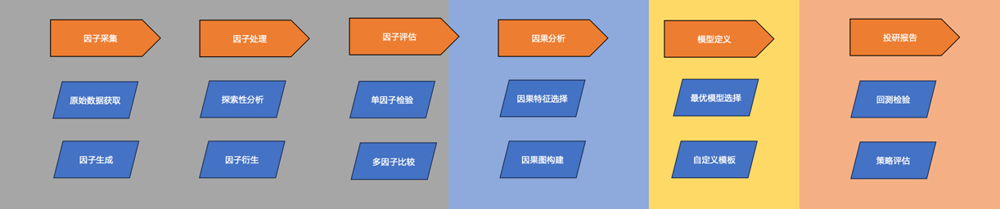

## trade-learn：使用 Python 搭建机器学习交易策略

trade-learn 是一个基于 alphalens、backtrader、pyfolio 和 quantstats 的机器学习策略研发工具包，提供因子采集、因子处理、因子评估、因果分析、模型定义和策略回测的全套策略研发流程，并支持可视化结果以 html 文件进行存档分享。



可视化图汇总：

<div align=center>

</div>

## 主要特性

1. 内嵌美国量化交易平台 quantopian 开源的策略研发组件，如 empyrical、alphalens、pyfolio 工具包。
1. 提供「雅虎财经」的股票行情，以及相应的因子计算公式，包括 alpha101 和 alpha191 因子集合。
2. 提供「通达信交易软件」的股票行情，以及配套的 30 个经验证的技术指标 tdx30，可直接对标通达信平台使用。
2. 交易策略使用信号驱动，提供多个不同类型的策略模板，快速搭建相应策略回测，支持「投机策略」和「投资组合策略」。
2. 提供「因果图构建」和「因果特征选择」算法，扩展 gplearn 的函数库，实现面向时序数据进行「特征衍生」。
6. 提供「探索性分析」和「最优模型选择」工具，迅速预览数据集的规律，以及常见模型在数据集的性能表现。
12. 裁剪 backtrader 回测框架，减少不必要的依赖安装，优化回测结果至 html 页面展示，拥有更友好的可视化互动。
14. 整个策略搭建过程，除了模型定义外，无需再引入其余第三方包，形成机器学习策略搭建的流程闭环。


## 下载方法

```bash
pip install trade-learn
```

```bash
pip install https://github.com/MuuYesen/trade-learn.git@master
```

## 使用模板
```python
from tradelearn.trader.signal import Signal
from tradelearn.strategy.backtest.single import LongBacktest

# 数据获取
raw_data, base_line = "标的行情数据", "基准行情数据"

# 定义回测起始日期和结束日期
bt_begin_date, bt_end_date = "回测的开始日期", "回测的结束日期"

# 定义信号类
class Example(Signal):

    def __init__(self, stockid, raw_data, bt_begin_date, bt_end_date, param_dict):
        signal_df = "计算出来的信号序列，含有 True、False 和 np.NAN 三种值，同时将日期设置成索引"
        
        self.set_signal(signal_df)

# 信号类参数字典
param_dict = {'fea_list': "用于发出信号的变量名称集合"}

# 运行回测
res = LongBacktest.run(Example, param_dict, raw_data, base_line, bt_begin_date, bt_end_date)
```
## 简单例子

**使用量价指标进行单标的买卖**：
```python
from tradelearn.query.query import Query  # 导入数据查询模块
from tradelearn.trader.signal import Signal  # 导入策略信号类
from tradelearn.strategy.backtest.single import LongBacktest  # 导入单支股票回测模块
from tradelearn.strategy.evaluate.evaluate import Evaluate  # 导入策略评估模块

import numpy as np


if __name__ == '__main__':
    
    # 定义数据起始日期和结束日期
    tn_begin_date = '2017-01-01'
    tn_end_date = '2022-06-22'

    # 查询股票600520的历史数据作为基准
    baseline = Query.history_ohlc(symbol='600520', start=tn_begin_date, end=tn_end_date, adjust='hfq', engine='tdx')

    # 获取原始数据并添加标签
    rawdata = Query.history_ohlc(symbol='600520', start=tn_begin_date, end=tn_end_date, adjust='hfq', engine='tdx')
    rawdata['label'] = rawdata['close'].pct_change(periods=5).shift(-1).map(lambda x: 1 if x > 0 else -1)

    # 定义回测起始日期和结束日期
    bt_begin_date = '2020-01-01'
    bt_end_date = '2022-06-22'
    
    # 定义RSI信号类
    class RSI(Signal):

        def __init__(self, stockid, raw_data, bt_begin_date, bt_end_date, param_dict):
            
            indi = Query.tec_indicator(raw_data, ['RSI']) # 计算相对强弱指标RSI

            # 生成全体区间的信号
            def signal(x):
                if x < 20:
                    return True
                if x > 40:
                    return False
                return np.NAN
            indi = indi.set_index('date').map(signal)

            # 保留回测区间的信号
            bt_indi = indi.query(f"date >= '{bt_begin_date}' and date < '{bt_end_date}'")

            self.set_signal(bt_indi)
    
    param_dict = {}
    
    # 运行回测
    res = LongBacktest.run(RSI, param_dict, rawdata, baseline, bt_begin_date, bt_end_date)

    # 分析回测结果
    Evaluate.analysis_report(res, baseline, engine='quantstats')  # 使用quantstats引擎进行回测结果分析
```

**使用机器学习模型进行投资组合的搭建**：  
```python
from tradelearn.query.query import Query  # 导入数据查询模块
from tradelearn.trader.signal import Signal  # 导入策略信号类
from tradelearn.strategy.backtest.fund import LongBacktest  # 导入长周期回测模块
from tradelearn.strategy.evaluate.evaluate import Evaluate  # 导入策略评估模块

import numpy as np
import pandas as pd
from dateutil.relativedelta import relativedelta

from sklearn.ensemble import RandomForestClassifier  # 导入随机森林分类器


if __name__ == '__main__':
    
    # 定义数据起始日期和结束日期
    tn_begin_date = '2017-01-01'
    tn_end_date = '2022-06-22'

    # 查询上证指数的历史数据作为基准
    baseline = Query.history_ohlc(symbol='000001.SS', start=tn_begin_date, end=tn_end_date, engine='yahoo')  ## 两个接口都是右开区间，所有都是包括自定义

    rawdata = None
    # 循环查询多只股票的历史数据并进行处理
    for i in range(10):
        temp = Query.history_ohlc(symbol='60052' + str(i), start=tn_begin_date, end=tn_end_date, adjust='hfq', engine='tdx')
        if temp is None:
            continue

        # 标记涨跌标签
        temp['label'] = temp['close'].pct_change(periods=5).shift(-1).map(lambda x: 1 if x > 0 else -1)
        rawdata = pd.concat([rawdata, temp], axis=0)

    # 定义回测起始日期和结束日期
    bt_begin_date = '2020-01-01'
    bt_end_date = '2022-06-22'
    
    # 定义随机森林指标类
    class RandomForest(Signal):

        model_dict = {}  # 模型字典

        def __init__(self, stockid, raw_data, bt_begin_date, bt_end_date, param_dict):
            fea_list = param_dict['fea_list']
            
            if not RandomForest.model_dict:
                # 构建随机森林模型并保存到模型字典中
                for date in pd.date_range(start=bt_begin_date, end=bt_end_date, freq='12MS'):
                    bt_train_data = raw_data.query(f"date >= '{date - relativedelta(months=12 * 3)}' and date < '{date}'")
                    bt_x_train, bt_y_train = bt_train_data[fea_list], bt_train_data['label']

                    model = RandomForestClassifier(random_state=42, n_jobs=-1)
                    model.fit(bt_x_train, bt_y_train)
                    RandomForest.model_dict[date.year] = model

            # 使用模型进行预测
            indi_df = None
            for date in pd.date_range(start=bt_begin_date, end=bt_end_date, freq='12MS'):
                pos_data = raw_data.query(f"code == '{stockid}' and date >= '{date}' and date < '{date + relativedelta(months=12 * 1)}'")
                bt_x_test = pos_data.set_index(['date'])[fea_list]
                pre_proba = RandomForest.model_dict[date.year].predict_proba(bt_x_test)[:, 1]
                indi_df = pd.concat([indi_df, pd.DataFrame(pre_proba, index=pos_data['date'])])

            self.set_signal(indi_df)

    # 特征列表，去除标签和代码以及日期列
    fea_list = rawdata.columns.drop(['label', 'code', 'date']).tolist()
    param_dict = {'fea_list': fea_list}
    
    # 运行回测
    res = LongBacktest.run(RandomForest, param_dict, rawdata, baseline, bt_begin_date, bt_end_date)
    
    # 分析回测结果
    Evaluate.analysis_report(res, baseline, engine='quantstats')  # 使用quantstats引擎进行回测结果分析
```
## 方法指南

要求具有 code 和 date 列

### 原始数据获取
```python
from tradelearn.query.query import Query

rawdata = Query.history_ohlc(symbol='600520', start='2017-01-01', end='2022-06-22', adjust='hfq',engine='tdx')
```
| 参数名称   | 数据类型   | 备注                                        |
|--------|--------|-------------------------------------------|
| symbol | string | 目标股票的编号                                   |
| start  | string | 开始日期                                      |
| end    | string | 结束日期                                      |
| adjust | string | 复权方式，可选择前复权和后复权，分别对应 'qfq' 和 'hfq'        |
| engine | string | 第三方数据源，可选择雅虎财经或通达信平台，分别对应 'yahoo' 和 'tdx' |

### 因子生成
```python
from tradelearn.query.query import Query

res = Query.alphas101(stock_data=rawdata, alpha_name=['alpha001'])
res = Query.alphas191(stock_data=rawdata, alpha_name=['alpha001'])
res = Query.tec_indicator(stock_data=rawdata, alpha_name=['ATR', 'RSI'])
```
| 参数名称       | 数据类型      | 备注                                            |
|------------|-----------|-----------------------------------------------|
| stock_data | DataFrame | 标的行情数据，要求具有 open、low、high、close、volume、vwap 列 |
| alpha_name | list      | 因子或者指标的名称列表                                   |

### 探索性分析
```python
from tradelearn.strategy.preprocess.explore.explore import Explore

Explore.analysis_report(data=rawdata, filename='res/explore.html')
```

| 参数名称     | 数据类型      | 备注              |
|----------|-----------|-----------------|
| data     | DataFrame | 标的行情数据          |
| filename | string    | html 文件的保存路径及名称 |
### 因子衍生
```python
from tradelearn.strategy.preprocess.derive.derive import Derive

res = Derive.generic_generate(data=rawdata)
```
| 参数名称     | 数据类型      | 备注                |
|----------|-----------|-------------------|
| data     | DataFrame | 标的行情数据            |
### 单因子检验
```python
from tradelearn.strategy.examine.examine import Examine

Examine.single_factor(data=data, col='alpha001_101', filename='res/examine.html')
```
| 参数名称     | 数据类型      | 备注                 |
|----------|-----------|--------------------|
| data     | DataFrame | 标的行情数据，要求具有两个及以上的股票 |
| col      | string    | 目标因子名称             |
| filename | string    | html 文件的保存路径及名称 |
### 多因子比较
```python
from tradelearn.strategy.examine.examine import Examine

res = Examine.factor_compare(data=data, f_col=None, ind=None, cir=None)
```
| 参数名称  | 数据类型      | 备注                                 |
|-------|-----------|------------------------------------|
| data  | DataFrame | 标的行情数据，要求具有两个及以上的股票                |
| f_col | string    | 需要进行比较的因子名称列表，当值为 None 时选择所有变量进行比较 |
| ind   | string    | 所属行业字段的名称，用于计算 t 检验，可选             |
| cir   | string    | 市值数据字段的名称，用于计算 t 检验，可选             |
### 因果特征选择
```python
from tradelearn.causal.blanket.blanket import Blanket

Blanket.fit_causal(data=rawdata, method='iamb', target_name='volume', is_discrete=False)
```
| 参数名称        | 数据类型      | 备注                      |
|-------------|-----------|-------------------------|
| data        | DataFrame | 标的行情数据                  |
| method      | string    | 选用的因果特征选择算法             |
| target      | string    | 因变量名称                   |
| alpha       | float     | 置信度水平，一般设置成 0.05 或 0.01 |
| is_discrete | bool      | data 数据是离散型变量，则设置为 True |
### 因果图构建
```python
from tradelearn.causal.graph.graph import Graph

Graph.fit_causal(data=rawdata, method='pc', is_discrete=False, filename='res/pc.png')
```
| 参数名称        | 数据类型      | 备注                      |
|-------------|-----------|-------------------------|
| data        | DataFrame | 标的行情数据                  |
| method      | string    | 选用的因果图构建算法              |
| is_discrete | bool      | data 数据是离散型变量，则设置为 True |
| filename    | string    | 因果图的保存路径及名称             |
### 最优模型选择
```python
from tradelearn.automl.automl import AutoML

model = AutoML.lazy_predict(data=data)
```
| 参数名称     | 数据类型      | 备注                |
|----------|-----------|-------------------|
| data     | DataFrame | 标的行情数据            |
### 回测检验
```python
from tradelearn.strategy.backtest.single import LongBacktest  # 单标的投机交易的策略模板调用  二选一
from tradelearn.strategy.backtest.fund import LongBacktest    # 多标的投资组合的策略模板调用  二选一

res = LongBacktest.run(model_class=Example, param_dict=param_dict, raw_data=rawdata, base_line=baseline,
                       begin_date=bt_begin_date, end_date=bt_end_date, show_source=True)
```
| 参数名称        | 数据类型      | 备注                        |
|-------------|-----------|---------------------------|
| model_class | Signal    | 信号类实现，需由用户自定义             |
| param_dict  | dict      | 信号类所需传递的参数字典              |
| raw_data    | DataFrame | 标的行情数据                    |
| base_line   | DataFrame | 基准行情数据                    |
| begin_date  | string    | 回测开始日期                    |
| end_date    | string    | 回测结束日期                    |
| show_source | bool      | html 文件是否展示策略源代码，默认为 True |
### 策略评估
```python
from tradelearn.strategy.evaluate.evaluate import Evaluate

Evaluate.analysis_report(strat=res, baseline=baseline, filename='./evaluate.html', engine='quantstats')
```
| 参数名称        | 数据类型      | 备注                                                            |
|-------------|-----------|---------------------------------------------------------------|
| strat | dict      | LongBacktest.run() 返回的数据字典                                    |
| baseline  | DataFrame | 基准行情数据                                                        |
| filename    | string    | 生成的 html 文件的路径及名称                                             |
| engine   | string    | 回测结果评估，可选择 pyfolio 或 quantstats，分别对应 'pyfolio' 和 'quantstats' |
## 致谢

- [Quantopian](https://github.com/quantopian)
- [Trevor Stephens](https://github.com/trevorstephens)
- [PyWhy](https://github.com/py-why)
- [DRo](https://github.com/mementum)
- [happydasch](https://github.com/happydasch)


## 联系方式

微信公众号：知守溪的收纳屋  &nbsp;&nbsp;&nbsp;&nbsp;&nbsp;&nbsp;&nbsp;&nbsp;&nbsp; 电子邮箱：muyes88@gmail.com

