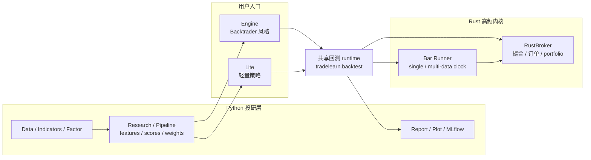
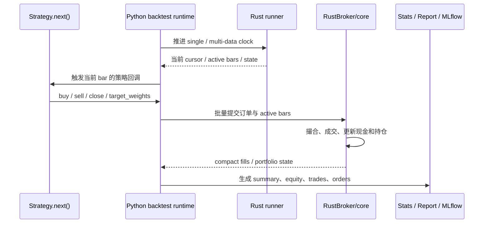
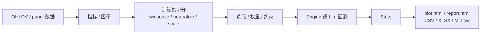
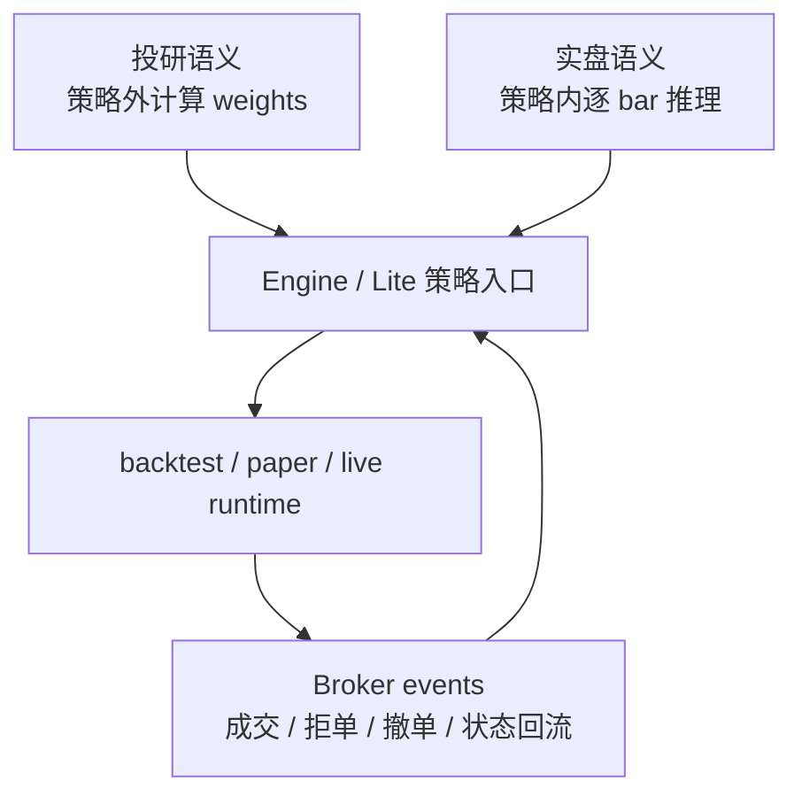

<p align="center">
  
</p>

<p align="center">
  <strong>Python 写策略与投研流程，Rust 扛事件驱动回测内核。</strong>
</p>

trade-learn 是一个面向量化研究和事件驱动回测的 Python/Rust 框架：**Python 负责表达策略和投研流程，Rust 负责高频回测内核**。

它想解决的不是“怎么跑一段回测”，而是把一条完整的策略研发链路接起来：

```text
数据 -> 指标 / 因子 -> 预处理 -> 选股 / 权重 -> 事件驱动回测 -> 报告 -> MLflow 追踪
```

你可以像写 Backtrader 一样写专业策略，也可以用 Lite API 快速验证一个想法；可以接入 TDX、TA-Lib、TradingView、pandas-ta-classic 等指标生态，也可以把因子分析、因果特征筛选、Optuna 参数优化、组合权重、回测报告和实验记录放进同一条工作流。

trade-learn 的目标很直接：让你把时间花在“策略是否有效”上，而不是反复处理数据切分、指标口径、订单记录、权益曲线、报告导出和实验追踪。

## 核心亮点

- **Lite 是推荐起点**：更短的写法，适合快速验证、教学、1.x 风格迁移和多资产目标权重；它不是另一套撮合逻辑，而是同一 runtime 的轻量语法。
- **Backtrader 风格 Engine**：保留成熟事件驱动模型，适合复杂策略、组合策略、Analyzer、Sizer、Signal 和未来 paper/live adapter。
- **Rust single / multi-data runner**：单标的走 Rust single-data runner，多标的 panel 自动切到 multi-data clock runner；用户仍然只写 `next()`。
- **高性能基线透明**：本机基线中，55 万 bar 单标的 Lite 约 **27.9x**、Engine 约 **11.0x**；1000 标的 20 年目标权重场景 Lite 约 **119.1x**、Engine 约 **69.7x**，均以 Backtrader 为 1.0x。
- **双市场指标生态**：A 股偏 TDX/MyTT 口径，海外和通用研究偏 TradingView、TA-Lib、pandas-ta-classic；回测层只认标准 OHLCV / panel，不把市场差异塞进策略 runtime。
- **机器学习与因果筛选**：`FeatureSet`、`Pipeline`、`CausalSelector`、`ResearchRun`、`Allocator` 把 train/test、preprocess、causal select、score、weights 和回测串起来。
- **Optuna 参数搜索**：`tradelearn.optimize` 提供用户级 Optuna 入口，Engine/Lite 的网格搜索只作为轻量 facade。
- **因子与报告**：提供 alphalens / pyfolio 风格分析图，支持 HTML 报告、plot、CSV/XLSX artifacts。
- **实验与协作**：支持 MLflow、JupyterLab、MCP，方便记录、复盘和自动化投研。

## 适合谁

- 已经会 Backtrader，但希望有更现代的报告、研究流水线和 Rust 回测内核。
- 正在做因子研究，希望从 alphalens 风格分析自然走到事件驱动回测。
- 正在做机器学习策略，希望把 train/test、预处理、因果筛选、评分、权重、回测和 MLflow 记录连起来。
- 需要同时覆盖 A 股和海外市场，不想让指标口径、数据形态和报告体系割裂。
- 需要同时维护规则策略和模型策略，不想让两套策略使用完全不同的数据、报告和实验体系。
- 想保留 Python 生态的灵活性，同时把撮合、订单推进和 portfolio 这类高频路径交给 Rust。

## 你可以从哪里开始

| 你想做什么 | 推荐入口 |
|---|---|
| 快速验证轻量策略或 1.x 风格策略 | `tradelearn.lite` |
| 迁移或编写 Backtrader 风格策略 | `tradelearn.engine` |
| 比较单因子 / 多因子的预测能力 | `tradelearn.factor` |
| 做训练集/测试集切分、预处理、选股、权重 | `tradelearn.research` |
| 做因果特征筛选或模型注册 | `tradelearn.ml` |
| 用 Optuna 做参数搜索 | `tradelearn.optimize` |
| 生成回测报告、收益/回撤/交易分析图 | `tradelearn.report` |
| 记录参数、指标、HTML、CSV/XLSX artifacts | MLflow 集成 |
| 在 notebook / lab 环境里做交互式研究 | `tradelearn.lab` / JupyterLab |
| 接入自动化工具和智能助手工作流 | `tradelearn.mcp` |
| 同时覆盖 A 股与海外市场指标口径 | `tl.tdx` / `tl.talib` / `tl.tv` / `tl.pta` |

最短路径：

```text
Lite 用户：DataFrame -> Backtest -> Strategy -> stats / plot / report
Engine 用户：DataFrame -> Cerebro -> Strategy -> stats / plot / report
研究用户：DataFrame -> research/factor -> weights -> Backtest/Cerebro -> MLflow
```

## 快速上手

### Lite：更短的策略写法

适合快速验证、教学、小型策略、多资产目标权重和 1.x 风格迁移。

```python
import tradelearn.lite as tl
from tradelearn.data import TradingViewProvider


class LiteSmaCross(tl.Strategy):
    fast = 10
    slow = 20

    def init(self):
        self.fast_ma = tl.tdx.MA(self.data.close, N=self.fast)
        self.slow_ma = tl.tdx.MA(self.data.close, N=self.slow)
        self.start_on_bar(self.slow + 1)

    def next(self):
        if self.fast_ma[0] > self.slow_ma[0] and not self.position():
            self.buy(size=100)
        elif self.fast_ma[0] < self.slow_ma[0] and self.position():
            self.position().close()


provider = TradingViewProvider(n_bars=500)
bars = provider.history_ohlc("NASDAQ:AAPL", start="2023-01-01", end="2024-01-01")

bt = tl.Backtest(bars, LiteSmaCross, cash=100_000, commission=0.0003, trade_on_close=True)
stats = bt.run()

print(stats.summary)
bt.plot("plot.html")
bt.report("report.html")
```

### Engine：Backtrader 风格专业入口

适合复杂策略、组合策略、Analyzer / Observer / Sizer、信号策略、参数优化和未来 paper/live adapter。

```python
import tradelearn.engine as bt
from tradelearn.data import TradingViewProvider


class SmaCross(bt.Strategy):
    params = (("fast", 10), ("slow", 20))

    def __init__(self):
        self.fast = bt.tdx.MA(self.data.close, N=self.p.fast)
        self.slow = bt.tdx.MA(self.data.close, N=self.p.slow)

    def next(self):
        if self.fast[0] != self.fast[0] or self.slow[0] != self.slow[0]:
            return
        if not self.position and self.fast[0] > self.slow[0]:
            self.buy(size=100)
        elif self.position and self.fast[0] < self.slow[0]:
            self.close()


provider = TradingViewProvider(n_bars=500)
bars = provider.history_ohlc("NASDAQ:AAPL", start="2023-01-01", end="2024-01-01")

cerebro = bt.Cerebro(trade_on_close=True)
cerebro.setcash(100_000)
cerebro.setcommission(0.0003)
cerebro.adddata(bars, name="AAPL")
cerebro.addstrategy(SmaCross)

[strategy] = cerebro.run()

print(strategy.stats.summary)
cerebro.plot("plot.html")
cerebro.report("report.html")
```

## 架构速览

trade-learn 的结构分成三条清晰的线：用户写策略，Python 组织研究流程，Rust 负责高频回测内核。


```mermaid
flowchart LR
    subgraph user[用户入口]
        lite[Lite\n轻量策略]
        engine[Engine\nBacktrader 风格]
    end

    subgraph research[Python 投研层]
        data[Data / Indicators / Factor]
        pipeline[Research / Pipeline\nfeatures / scores / weights]
        report[Report / Plot / MLflow]
    end

    runtime[共享回测 runtime\ntradelearn.backtest]

    subgraph rust[Rust 高频内核]
        runner[Bar Runner\nsingle / multi-data clock]
        broker[RustBroker\n撮合 / 订单 / portfolio]
    end

    data --> pipeline
    pipeline --> engine
    pipeline --> lite
    engine --> runtime
    lite --> runtime
    runtime --> runner
    runtime --> broker
    runner --> broker
    runtime --> report
```

运行路径可以理解成：


```mermaid
sequenceDiagram
    participant S as Strategy.next()
    participant BT as Python backtest runtime
    participant RR as Rust runner
    participant R as RustBroker/core
    participant ST as Stats / Report / MLflow

    BT->>RR: 推进 single / multi-data clock
    RR-->>BT: 当前 cursor / active bars / state
    BT->>S: 触发当前 bar 的策略回调
    S->>BT: buy / sell / close / target_weights
    BT->>R: 批量提交订单与 active bars
    R->>R: 撮合、成交、更新现金和持仓
    R-->>BT: compact fills / portfolio state
    BT->>ST: 生成 summary、equity、trades、orders
```

投研闭环则是：


```mermaid
flowchart LR
    bars[OHLCV / panel 数据]
    factors[指标 / 因子]
    prep[训练集切分\nwinsorize / neutralize / scale]
    weights[选股 / 权重 / 约束]
    bt[Engine 或 Lite 回测]
    stats[Stats]
    artifacts[plot.html / report.html\nCSV / XLSX / MLflow]

    bars --> factors --> prep --> weights --> bt --> stats --> artifacts
```

## Pipeline 体系

trade-learn 的 Pipeline 不是为了把策略写成黑盒，而是为了把机器学习策略里最容易混乱的部分固定下来：**训练期只 fit，运行期只 transform / predict / build weights**。

它主要由三类对象组成：

- `FeatureSet`：把原始 OHLCV / panel 数据转换成特征和标签。
- `Pipeline`：串联 `Winsorizer`、`Neutralizer`、`StandardScaler` 等预处理组件，统一提供 `fit()`、`transform()`、`fit_transform()`。
- `ResearchRun` / `ResearchResult`：记录每一步研究动作、参数、scores、weights 和 artifacts，之后可以交给 Engine 或 Lite 执行。

典型流程是：

```text
历史数据
  -> FeatureSet 生成特征/标签
  -> time_split 切分训练集/测试集
  -> Pipeline.fit(train)
  -> Pipeline.transform(test)
  -> model.predict(test)
  -> Allocator 生成目标权重
  -> Engine/Lite 执行 target_weights 或 order_target_percent
  -> Stats / Report / MLflow
```

对应代码心智：

```python
features = feature_set.fit_transform(bars, include_target=True).dropna()
train, test = research.time_split(features, split="2023-09-01", level="timestamp")

pipeline = research.Pipeline([
    research.preprocess.Winsorizer(columns=["alpha"]),
    research.preprocess.Neutralizer(columns=["alpha"], exposures=["size"]),
    research.preprocess.StandardScaler(columns=["alpha"]),
])

train = pipeline.fit_transform(train)
test = pipeline.transform(test)
scores = scorer.predict(test)
weights = allocator.build(scores)
```

这套设计的重点是可复现：同一套特征、预处理参数、模型、权重和回测结果可以被记录到 `ResearchResult` 和 MLflow，而不是散在脚本变量里。

## 投研语义与实盘语义

trade-learn 明确区分两种运行方式：

| 语义 | 适合场景 | 计算位置 | 回测执行 |
|---|---|---|---|
| 投研语义 | 离线因子检验、指数增强、模型评估 | 策略外提前算好 features / scores / weights | 策略读取 `research_result.weights` 下单 |
| 实盘语义 | paper/live、接近真实交易的逐 bar 推理 | 策略内用 `history_panel()` 取当前可见窗口，再 transform / predict / build weights | 策略当场生成目标权重并下单 |

投研语义更适合批量研究：你先在策略外完成训练、打分和权重生成，再把测试期 bars 和 weights 交给回测。它的好处是快、清晰、方便复盘；要求是必须用 `split_bars()` 只回测测试期，避免训练期空仓或训练数据进入评估。

投研例子：

```python
# 策略外：训练、预测、生成测试期目标权重
features = feature_set.fit_transform(bars, include_target=True).dropna()
train, test = research.time_split(features, split="2023-09-01", level="timestamp")
train = pipeline.fit_transform(train)
test = pipeline.transform(test)
scores = scorer.predict(test)
weights = allocator.build(scores)

research_result = run.finish(features=test, scores=scores, weights=weights)
test_bars = research.split_bars(bars, split="2023-09-01")


class Portfolio(tl.Strategy):
    def next(self):
        if len(self.data) % 20 == 0:
            self.target_weights(self.research_result.weights[0], close_missing=True)


stats = tl.Backtest(test_bars, Portfolio).run(research_result=research_result)
```

实盘语义更接近未来 paper/live：策略每次 `next()` 只能看到当前及历史 bar，通过 `history_panel(lookback)` 取可见窗口，在策略内部完成预处理、预测和调仓。它的好处是和真实交易心智一致；代价是运行时计算更多。

实盘例子：

```python
class LiveLikePortfolio(bt.Strategy):
    params = (
        ("history_window", 21),
        ("runtime_pipeline", None),
        ("scorer", None),
        ("allocator", None),
    )

    def next(self):
        # 这里只能看到当前 bar 之前已经出现的数据
        features = self.p.runtime_pipeline.transform(
            self.history_panel(self.p.history_window)
        )
        scores = self.p.scorer.predict(features)
        weights = self.p.allocator.build(scores)

        for data in self.datas:
            self.order_target_percent(data=data, target=weights.get(data._name))
```


```mermaid
flowchart TB
    offline[投研语义\n策略外计算 weights]
    live[实盘语义\n策略内逐 bar 推理]
    engine[Engine / Lite 策略入口]
    runtime[backtest / paper / live runtime]
    broker[Broker events\n成交 / 拒单 / 撤单 / 状态回流]

    offline --> engine
    live --> engine
    engine --> runtime
    runtime --> broker
    broker --> engine
```

因此，trade-learn 的实盘扩展不是把回测同步撮合语义硬套到真实 broker 上，而是保留同一条事件链：策略产生订单意图，broker 执行并通过事件回流状态。QMT、paper 或其他 live adapter 应该接入这条 broker event 语义，而不是让策略假设“下单后立即成交”。

## 为什么选择 Backtrader 风格

trade-learn 选择 Backtrader 风格作为 Engine 主入口，不是为了复刻旧 API，而是因为它的专业交易语义足够完整：`Cerebro` 管理运行，`Strategy` 只表达策略，`DataFeed`、`Broker`、`Sizer`、`Analyzer`、`Observer` 各司其职。这个模型天然适合事件驱动、组合策略、多数据源、订单生命周期和未来实盘 adapter。

对用户来说，这带来两个好处：

- **专业策略容易迁移**：已有 Backtrader 心智的用户可以继续使用 `next()`、`buy()`、`sell()`、`close()`、`order_target_percent()`、Analyzer、Sizer 等概念。
- **扩展边界清楚**：要加数据源就扩展 `DataFeed`，要加统计就写 `Analyzer`，要加仓位规则就写 `Sizer`，要接 paper/live broker 就接 broker event，不需要把所有逻辑塞进一个策略类。

Lite 则保留更轻的写法，用来快速验证和教学；当策略变复杂、需要完整订单生命周期和扩展点时，可以自然迁移到 Engine。

## 对齐与性能基线

trade-learn 的正确性先看 Engine。`tradelearn.engine` 以 Backtrader 为 oracle，`benchmarks/runners/benchmark_bt.py` 会对代表性策略做最终权益、交易明细和 PnL 对齐；当前主线要求 Engine 与 Backtrader 保持 `EXACT`。

Lite 不是 Backtrader facade，它是更薄的策略语法层。Lite 与 Engine 共用 `tradelearn.backtest` runtime 和 Rust 撮合内核，因此 Lite 的验收重点是：API 能正确接入同一 runtime，返回统计字段与 Engine 一致，最终权益 / 成交数 / 平仓交易数与同一策略语义保持一致。

### 大样本性能

本机基线只看两个问题：结果是否对齐、吞吐是否明显快于 Backtrader。

速度基线的重点不是单次跑分，而是确认同一套事件驱动语义在 single-data 与 multi-data 两条 Rust runner 上都能保持数值对齐，并且吞吐有明确优势。

**55 万 bar 单标的 SMA**

| 引擎 | 耗时 | bars/s | 加速比 | Final Value | Fills | Closed Trades |
| --- | ---: | ---: | ---: | ---: | ---: | ---: |
| Tradelearn Lite | 1.3253s | 414,990 | 27.9x | 118,399.33 | 10,299 | 5,149 |
| Tradelearn Engine | 3.3767s | 162,883 | 11.0x | 118,399.33 | 10,299 | 5,149 |
| Backtrader | 37.0270s | 14,854 | 1.0x | 118,399.33 | 10,299 | 5,149 |

**1000 标的、约 20 年、月频 top-50 目标权重**

该场景总计 5,040,000 根 data bars，用于验证大规模多资产 `order_target_percent` / `target_weights` 的执行语义与吞吐。

| 引擎 | 耗时 | bars/s | 加速比 | Final Value | Completed Orders | Target Intents | Targets |
| --- | ---: | ---: | ---: | ---: | ---: | ---: | ---: |
| Tradelearn Lite | 2.407s | 2,094,237 | 119.1x | 4,199,638.26 | 23,249 | 23,249 | 239 |
| Tradelearn Engine | 4.112s | 1,225,594 | 69.7x | 4,199,638.26 | 23,249 | 23,249 | 239 |
| Backtrader | 286.538s | 17,589 | 1.0x | 4,199,638.26 | 23,249 | 23,249 | 239 |

结论：Engine 与 Backtrader 在最终权益、完成订单数、目标意图数和 rebalance 次数上全部 `EXACT`；Engine 约为 Backtrader 的 **69.7x**，Lite 约为 **119.1x**。这些数字不作为跨机器的绝对性能承诺；正式质量门禁仍然是 Engine 与 Backtrader 的订单生命周期和交易明细保持 `EXACT`。

### Examples 对齐审计

#### 单标的示例

Lite 示例先验收“能否正确接入同一 runtime”。当前 smoke 覆盖 Lite 示例和组合示例，最近一次结果为 `5 passed`。

Engine 示例进入 `benchmark_bt.py`，以 Backtrader 为 oracle 做严格数值审计。表格中 `TL / BT` 分别表示 Tradelearn Engine 与 Backtrader：

| 策略 | Final Value TL / BT | Closed Trades TL / BT | Closed PnL TL / BT | PnLComm TL / BT | 状态 |
| --- | ---: | ---: | ---: | ---: | --- |
| QuickstartSmaCross | 100026.14 / 100026.14 | 16 / 16 | 26.14 / 26.14 | 26.14 / 26.14 | EXACT |
| SmaCross | 99630.56 / 99630.56 | 3 / 3 | -247.72 / -247.72 | -247.72 / -247.72 | EXACT |
| MigratedSmaCross | 99997.70 / 99997.70 | 21 / 21 | -2.30 / -2.30 | -2.30 / -2.30 | EXACT |
| Turtle | 99995.64 / 99995.64 | 8 / 8 | -4.36 / -4.36 | -4.36 / -4.36 | EXACT |
| EnhancedRSI | 97875.79 / 97875.79 | 6 / 6 | -2124.21 / -2124.21 | -2124.21 / -2124.21 | EXACT |
| BetterMA | 100000.00 / 100000.00 | 0 / 0 | 0.00 / 0.00 | 0.00 / 0.00 | EXACT |
| MacdTharp | 99998.98 / 99998.98 | 2 / 2 | -1.02 / -1.02 | -1.02 / -1.02 | EXACT |
| OrderExecutionStrategy | 99994.05 / 99994.05 | 13 / 13 | -5.95 / -5.95 | -5.95 / -5.95 | EXACT |

#### 多标的组合示例

多标的组合 / 指数增强策略也走同一条 Backtrader 对齐链路。`benchmark_bt.py --include-portfolio` 会同时审计目标权重、资产类别目标权重、等权、趋势过滤、反波动率等多数据策略：

| 多标的策略 | Final Value TL / BT | Orders TL / BT | Targets TL / BT | 状态 |
| --- | ---: | ---: | ---: | --- |
| TargetPercentPortfolioStrategy | 104447.50 / 104447.50 | 14 / 14 | 6 / 6 | EXACT |
| AssetClassTargetPortfolioStrategy | 104003.95 / 104003.95 | 21 / 21 | 6 / 6 | EXACT |
| UniformAssetClassPortfolioStrategy | 104155.45 / 104155.45 | 22 / 22 | 6 / 6 | EXACT |
| TrendFilteredPortfolioStrategy | 103430.20 / 103430.20 | 21 / 21 | 6 / 6 | EXACT |
| InverseVolatilityPortfolioStrategy | 104410.00 / 104410.00 | 9 / 9 | 6 / 6 | EXACT |

严格门禁只比较 **Tradelearn Engine vs Backtrader**：两者使用相同的目标权重意图、相同的 sell-first 调仓顺序，并跳过最后一根 K 线上的 terminal rebalance。原因是 Backtrader 在最后一根 bar 上会返回订单对象，但没有后续生命周期去发出 Submitted / Accepted / Completed 通知；这类订单没有可比的完整撮合生命周期，不应计入正式订单数对齐。

Rust runner 由 runtime 自动选择，用户不需要显式配置：

| 场景 | 自动路径 | 触发条件 |
| --- | --- | --- |
| 单标的 | Rust single-data runner | `RustBroker` 已绑定 Rust engine，且只有 1 个 data feed |
| 多标的 | `RustClockedMultiDataRunner` | `RustBroker` 已绑定 Rust engine，`len(cerebro.datas) > 1`，并且每个 feed 暴露 `_datetime/_open/_high/_low/_close/_volume` 数组 |
| 自定义 feed / 非 Rust broker | Python fallback | 不满足上述数组协议或 broker 条件 |

Lite 与 Engine 共用 backtest runtime 和 Rust 撮合内核。该 benchmark 中 Lite 与 Engine / Backtrader 的最终权益和订单生命周期计数也保持一致；质量门禁仍以 Engine vs Backtrader 为准，Lite 侧重点是 API smoke、stats 字段一致性和吞吐表现。

复现入口：

```bash
# Engine vs Backtrader 严格数值审计
uv run python benchmarks/runners/benchmark_bt.py smart --repeat 1 --warmup 0

# Engine vs Backtrader 多标的组合 / 指数增强审计
uv run python benchmarks/runners/benchmark_bt.py smart --repeat 1 --warmup 0 --include-portfolio

# Engine / Lite / Backtrader 吞吐与统计口径对比
uv run python benchmarks/runners/benchmark_throughput.py --bars 550000 --repeat 1 --warmup 0

# 1000 标的、20 年目标权重 parity benchmark
uv run python benchmarks/runners/benchmark_target_weight_parity.py \
  --symbols 1000 --bars 5040 --holdings 50 --rebalance-every 21
```

## 当前定位

trade-learn 2.x 当前定位为：

- **事件驱动回测框架**：以 bar 推进、订单、成交、持仓、资金曲线为主线。
- **Lite 快速研究 API**：`tradelearn.lite` 提供更短的策略写法，适合快速验证、多资产目标权重和 1.x 风格迁移。
- **Backtrader 风格高级 API**：`tradelearn.engine` 对齐 Backtrader 的 Cerebro / Strategy / Analyzer / Sizer / Signal 心智。
- **Python 指标生态优先**：指标不下沉 Rust，统一接入 `talib`、`tdx`、`tv`、`pta` 等 Python 侧指标命名空间。
- **双市场研究心智**：A 股可以走 TDX/MyTT 口径，海外和通用数据可以走 TradingView、TA-Lib、pandas-ta-classic；策略和回测层仍然只面对标准 OHLCV / panel。
- **研究流水线**：`tradelearn.research` 提供数据探索、切分、预处理、特征生成、权重构建、实验记录等组件。
- **机器学习与因果筛选**：`tradelearn.ml` 提供 `CausalSelector`、模型注册与模型加载能力，和 research / backtest / MLflow 串成一条机器学习策略研发链。
- **报告与可视化**：`tradelearn.report` 提供 pyfolio / alphalens 风格分析图和 HTML 报告。
- **实验追踪**：支持 MLflow 记录参数、指标、报告、图表、CSV/XLSX artifacts。
- **参数搜索**：`tradelearn.optimize` 是用户级 Optuna 入口；Engine 的 `grid_search()` 与 Lite 的 `Backtest.optimize()` 只复用内部 `tradelearn.backtest._optimize` grid helper，用户不直接依赖 backtest 内部模块。
- **单标的 / 多标的 runner**：runtime 会按数据形态自动选择 Rust single-data runner 或 multi-data clock runner；用户不需要为性能路径改写策略。
- **大样本统计**：Engine/Lite 都支持 `stats_mode="lazy"`。该模式先返回 summary，`equity`、`fills`、`trades`、`positions`、`orders` 等 pandas artifacts 会在访问、report 或 MLflow 上传时再 materialize。

可选集成模块不属于策略主路径：

- `tradelearn.brokers`：paper/live broker adapter 层，用于后续接真实或模拟交易通道。
- `tradelearn.lab`：本地研究环境启动入口，负责 JupyterLab、MCP 和本地 MLflow 的启动计划。
- `tradelearn.mcp`：外部工具和智能助手集成入口，只暴露项目、配置、API 检索和 lab plan 等工具能力。

这三类模块都是 optional integration，不承载 Engine/Lite 策略语义，也不应反向进入 `tradelearn.backtest` runtime。

## 设计原则

trade-learn 的实操原则是：

> 以事件驱动为核心，Rust 只承担撮合、bar loop、订单推进、portfolio 等高性能回测内核；指标计算不下沉 Rust，而是通过 TA-Lib、pandas-ta-classic、TDX、TradingView 等 Python 生态工具做批量缓存或 rolling 计算；Python 保持清晰的策略、指标和兼容层边界，core 只放跨 backtest/paper/live 的中性契约，backtest 只放公共回测 runtime，Engine/Lite 专属语义各自留在 facade；所有优化都必须在不破坏结果对齐、策略 API 和未来实盘扩展边界的前提下推进；性能优化服务于事件驱动架构，不为了极限跑分牺牲策略 API 清晰度。

换句话说：

- Rust 是回测内核，不是策略语言。
- Engine/Lite 是用户入口，不是 runtime 实现层。
- `tradelearn.backtest` 是共享回测 runtime，不建议用户直接依赖。
- `tradelearn.core` 只放中性契约，不放 Backtrader、Lite 或回测专属实现。
- 指标、因子、报告、研究工具保持 Python 生态可组合。
- `pyrust-bt` 类项目只作为热路径工程参考；TradeLearn 不引入 action-dict / `next_multi()` 这类并列策略模型，也不新增绕开 `tradelearn.factor` 的轻量因子评估 API。

## 核心能力

### 1. 事件驱动回测

- Rust 内核负责 exact / smart K 线撮合、订单推进、成交、现金、持仓和权益计算。
- 单标的自动走 Rust single-data runner，多标的 panel 在满足数组协议时自动走 Rust multi-data clock runner。
- Python 策略保持 `next()`、`buy()`、`sell()`、`close()`、`order_target_percent()` 等事件驱动写法。
- Engine 和 Lite 共用同一套 `tradelearn.backtest` runtime 与 `Stats` 口径。

### 2. 多资产与组合

数据 provider 可以返回单标的 OHLCV，也可以返回 `MultiIndex(timestamp, symbol)` 的 panel。Engine 的 `Cerebro.adddata(panel)` 会自动按 symbol 拆成多个 feed；Lite 的 `Backtest(panel, Strategy)` 也会自动识别多标的。

多资产历史窗口可以使用 tradelearn 增强接口：

```python
panel = self.history_panel(lookback=20)
```

它返回最近已经可见的 OHLCV panel，索引为 `timestamp / symbol`。该接口是 tradelearn 增强能力，不是 Backtrader 原生接口。

### 3. 指标系统

内置指标统一走命名空间：

- `tl.talib` / `bt.talib`：TA-Lib 风格指标。
- `tl.tdx` / `bt.tdx`：TDX / MyTT 口径指标。
- `tl.tv` / `bt.tv`：TradingView / PyneCore 口径指标。
- `tl.pta` / `bt.pta`：pandas-ta-classic 口径指标。

同一个指标函数可以接收 tradelearn line，也可以接收 pandas / numpy 数据。传入 line 时会自动包装成对应 facade 的指标对象；传入普通 Series 时返回普通计算结果。

当前覆盖边界：

- 命名规则：`tdx`、`talib`、`tv` 均提供大小写兼容别名。文档里的指标列表只写 canonical 名称，用户可以按自己习惯调用 `tdx.MA` / `tdx.ma`、`tv.rsi` / `tv.RSI`。
- `tdx`：TDX / MyTT 经典指标已覆盖 30+ 常用函数，并提供大小写兼容别名；TDX 仍可用，但不是海外数据工作流默认主路径。当前 canonical 指标：`asi`, `atr`, `bbi`, `bias`, `boll`, `brar`, `cci`, `cr`, `dfma`, `dmi`, `dpo`, `ema`, `emv`, `expma`, `kdj`, `ktn`, `ma`, `macd`, `mass`, `mfi`, `mtm`, `obv`, `psy`, `roc`, `rsi`, `sma`, `taq`, `trix`, `vr`, `wma`, `wr`, `xsii`。
- `tv`：以 PyneCore common subset 为主，覆盖 30+ 常用 TradingView / Pine 风格指标；不是完整 TradingView/Pine 语言实现。少量 PyneCore 未直接覆盖的常用指标会保留本地 fallback，并通过 `COVERED_PYNECORE` 标记覆盖状态。当前 canonical 指标：`adx`, `alma`, `atr`, `bb`, `bbands`, `bbw`, `cci`, `change`, `cmo`, `cum`, `dmi`, `ema`, `hma`, `ichimoku`, `kc`, `kcw`, `linreg`, `macd`, `mfi`, `mom`, `obv`, `rma`, `roc`, `rsi`, `sar`, `sma`, `stdev`, `stoch`, `supertrend`, `swma`, `tr`, `tsi`, `variance`, `vwap`, `wma`。

### 4. 因子分析

`tradelearn.factor` 提供 alphalens 风格因子清洗和分析：

```python
from tradelearn.factor import FactorAnalyzer, clean_factor_and_forward_returns

clean = clean_factor_and_forward_returns(
    factors,
    factor="momentum",
    prices=prices,
    periods=(1, 5, 10),
    quantiles=5,
)

fa = FactorAnalyzer.from_clean_factor_data(clean)
fa.report("factor_report.html")
```

单因子和多因子都通过同一套 clean factor data 进入分析器。默认报告可以同时覆盖多个 forward return 周期。

### 5. 研究流水线

`tradelearn.research` 面向投研流程：

- `explore.profile()`：数据概览。
- `split.time_split()` / `split_bars()`：训练期 / 测试期切分。
- `preprocess.Winsorizer / Neutralizer / StandardScaler`：预处理组件。
- `derive.SymbolicFeatureGenerator`：符号特征生成。
- `portfolio.select_top / equal_weight / apply_constraints / Allocator`：组合权重构建。
- `ResearchRun` / `ResearchResult`：记录研究步骤、参数、权重和 artifacts。

`tradelearn.ml` 衔接机器学习策略研发：

- `CausalSelector`：用于相关性、PC、FCI 或自定义 backend 的候选因果特征筛选。
- `ModelRegistry` / `ModelLoader`：用于把训练好的模型纳入可复现的研究与回测流程。
- `AutoML`：延迟加载的自动建模入口，适合和 Optuna / MLflow 组合使用。

参数优化使用用户级 `tradelearn.optimize`，内部基于 Optuna；Engine/Lite 的简单 grid 接口只保留为 facade sugar，不建议把策略优化逻辑写进 `tradelearn.backtest` runtime。

研究阶段可以使用完整数据拟合特征、预处理器和模型；回测阶段建议使用 `split_bars()` 只传测试期 bar，避免训练期空仓区间进入策略评估。

### 6. 报告与图表

回测结果通过统一 `Stats` 对象提供：

- `summary`
- `equity`
- `returns`
- `fills`
- `trades`
- `positions`
- `orders`
- `config`

Engine：

```python
[strategy] = cerebro.run()
cerebro.plot("plot.html")
cerebro.report("report.html")
```

Lite：

```python
stats = bt.run()
bt.plot("plot.html")
bt.report("report.html")
```

`Reporter` 可以单独接收收益、持仓和成交，生成 pyfolio 风格报告；`FactorAnalyzer` 生成 alphalens 风格报告。

### 7. MLflow

Lite 和 Engine 都可以记录 MLflow：

- Lite 使用 `Backtest.log_mlflow(...)`，适合 run 后轻量上传。
- Engine 使用 `MLflowAnalyzer`，接入 analyzer 生命周期。

可记录内容包括参数、核心指标、报告 HTML、图表 HTML、CSV artifacts、XLSX artifacts 等。

报告 / MLflow artifacts 带有稳定的产物元信息：`metadata.csv` 与 `artifacts.xlsx` 的 `metadata` sheet 会写入 `artifact_schema_version=1.0` 和 `artifact_kind=backtest`。下游系统应先检查这两个字段再解析 `summary`、`equity`、`trades`、`weights`、`research` 等表；兼容性新增可以添加 sheet 或列，破坏性变更必须提升 schema version。

## 安装

```bash
pip install trade-learn
```

开发版：

```bash
pip install git+https://github.com/MuuYesen/trade-learn.git@v2
```

可选能力：

```bash
pip install "trade-learn[mlflow]"
pip install "trade-learn[lab]"
pip install "trade-learn[research]"
pip install "trade-learn[all]"
```

## 项目结构

```text
tradelearn/
  core/        # 跨 backtest / paper / live 的中性契约
  backtest/    # 共享事件驱动回测 runtime
  engine/      # Backtrader 风格高级 API
  lite/        # Tradelearn Lite 快速研究 API
  data/        # 数据 provider 与数据处理
  indicators/  # talib / tdx / tv / pta 指标命名空间
  factor/      # alphalens 风格因子分析
  research/    # 投研流水线、预处理、组合权重构建
  report/      # pyfolio 风格报告与图表
  ml/          # ML 策略与模型工具
  lab/         # JupyterLab / MCP 等研究环境集成
```

## 示例

- `examples/engine/`：Engine / Backtrader 风格策略。
- `examples/lite/`：Lite 轻量策略。
- `examples/research/`：指数增强、研究流水线、MLflow 示例。
- `examples/full_workflow_engine.py`：Engine 完整投研流程。
- `examples/full_workflow_lite.py`：Lite 完整投研流程。

## 文档

- API 与组件调用：`design/COMPONENT_USAGE.md`
- 项目结构：`design/PROJECT_STRUCTURE.md`
- 开发运行手册：`design/RUNBOOK.md`
- 在线文档站点：`mkdocs serve`

## 当前状态

trade-learn 2.x 仍处于快速迭代阶段。稳定主路径是：

1. 使用 `tradelearn.engine` 对齐 Backtrader 风格策略。
2. 使用 `tradelearn.lite` 快速验证和迁移 1.x 风格策略。
3. 使用 `tradelearn.research + factor + report + MLflow` 完成投研闭环。

不建议用户直接依赖 `tradelearn.backtest` 或 `tradelearn.core` 的内部实现细节。
