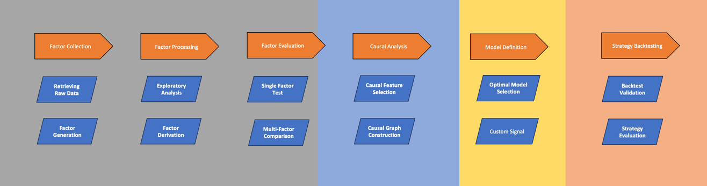
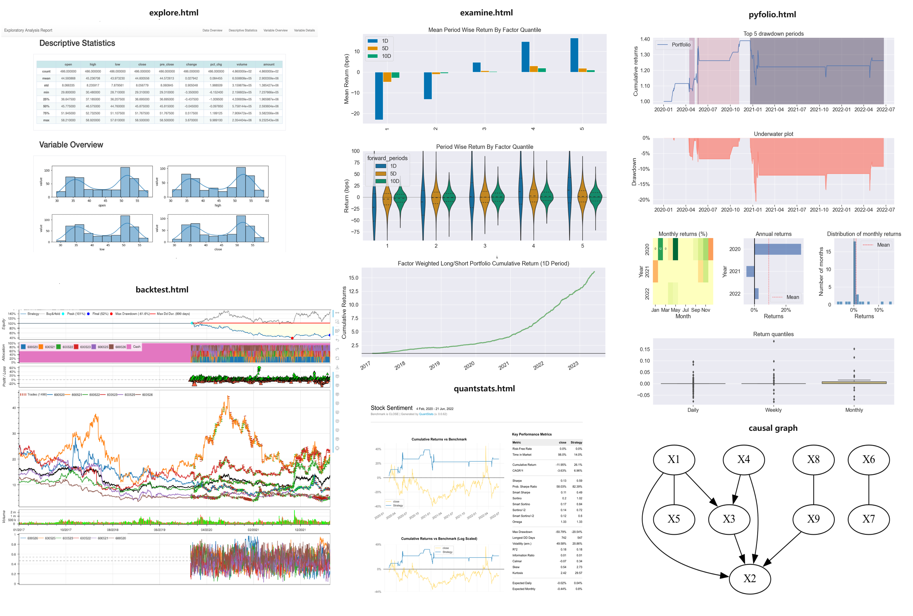

## trade-learn：使用 Python 搭建机器学习交易策略

trade-learn 是一个基于 alphalens、backtrader、pyfolio 和 quantstats 的机器学习策略研发工具包，提供因子采集、因子处理、因子评估、因果分析、模型定义和策略回测的全套策略研发流程，并支持可视化结果以 html 文件进行存档分享。



可视化图汇总：

<div align=center>

</div>

## 主要特性
1. 提供多个不同类型的策略模板，用户只需要给出对应的信号序列即可完成回测评估。
2. 提供因果分析工具，更加细致地探索因子之间的相互影响机制。
3. 提供因果特征选择算法，为因子筛选进行因果赋能。
3. 支持传统指标策略和机器学习策略，单只标的的投机策略和多个标的的投资组合策略。
4. 提供大量的因子计算公式，包含alpha101、alpha191和tdx30。
5. 提供外内盘股票行情的接口，同时对标通达信。
6. 计算结果可以保存成html文件，使用浏览器进行浏览。
7. 提供探索性分析。
8. 扩展 gplearn 的函数库，面向时序数据进行特征衍生。
9. 提供最优模型选择工具，可一览常见统计模型的性能。
10. 使用足够简单，可以训练加预测一体，也可以加载模型权重再得到信号。
11. 各组件都进行削减，仅保留需要的功能，减少不必要的依赖下载。

## 下载方法

```bash
pip install trade-learn
```

```bash
pip install https://github.com/MuuYesen/trade-learn.git
```

## 简单例子

**使用量价指标进行单标的买卖**：
```python
from tradelearn.query.query import Query  # 导入数据查询模块
from tradelearn.strategy.preprocess.explore.explore import Explore  # 导入数据探索模块
from tradelearn.trader.utils.align import Align
from tradelearn.strategy.backtest.single import LongBacktest  # 导入单支股票回测模块
from tradelearn.strategy.evaluate.evaluate import Evaluate  # 导入策略评估模块

import numpy as np

import tradelearn.trader as bt


if __name__ == '__main__':
    # 定义数据起始日期和结束日期
    tn_begin_date = '2017-01-01'
    tn_end_date = '2022-06-22'

    # 查询股票600520的历史数据作为基准
    baseline = Query.history_ohlc(symbol='600520', start=tn_begin_date, end=tn_end_date, adjust='hfq', engine='tdx')

    # 获取原始数据并添加标签
    rawdata = Query.history_ohlc(symbol='600520', start=tn_begin_date, end=tn_end_date, adjust='hfq', engine='tdx')
    rawdata['label'] = rawdata['close'].pct_change(periods=5).shift(-1).map(lambda x: 1 if x > 0 else -1)

    # 特征列表，去除标签和代码以及日期列
    fea_list = rawdata.columns.drop(['label', 'code', 'date']).tolist()

    # 数据探索
    Explore.analysis_report(rawdata)

    # 数据对齐
    rawdata = Align.transform(rawdata, baseline)

    # 定义随机森林指标类
    class RandomForestIndicator(bt.Indicator):

        lines = ("model_indi",)  # 指标线

        def __init__(self, stockid, fina_data, bt_begin_date, bt_end_date, fea_list):
            
            indi = Query.tec_indicator(fina_data, ['RSI']) # 计算相对强弱指标RSI

            # 生成信号
            def signal(x):
                if x < 20:
                    return True
                if x > 40:
                    return False
                return np.NAN
            indi = indi.set_index('date').map(signal)

            # 根据信号生成指标数据
            bt_indi = indi.query(f"date >= '{bt_begin_date}' and date < '{bt_end_date}'").values.reshape(-1)
            
            tmp_list = [np.NaN if fina_data['is_fake'].iloc[i] else bt_indi[i] for i in range(len(bt_indi))]
            self.lines.model_indi.array.extend(tmp_list)

    # 定义回测起始日期和结束日期
    bt_begin_date = '2020-01-01'
    bt_end_date = '2022-06-22'

    # 运行回测
    res = LongBacktest.run(test_data=rawdata,
                           base_line=baseline,
                           model_class=RandomForestIndicator,
                           feature_list=fea_list,
                           begin_date=bt_begin_date,
                           end_date=bt_end_date)

    # 分析回测结果
    Evaluate.analysis_report(res, baseline, engine='quantstats')  # 使用quantstats引擎进行回测结果分析

```

**使用机器学习模型进行投资组合的搭建**：  
```python
from tradelearn.query.query import Query  # 导入数据查询模块
from tradelearn.strategy.preprocess.explore.explore import Explore  # 导入数据探索模块
from tradelearn.trader.utils.align import Align
from tradelearn.strategy.backtest.fund import LongBacktest  # 导入长周期回测模块
from tradelearn.strategy.evaluate.evaluate import Evaluate  # 导入策略评估模块

import numpy as np
import pandas as pd
from dateutil.relativedelta import relativedelta

import tradelearn.trader as bt
from sklearn.ensemble import RandomForestClassifier  # 导入随机森林分类器


if __name__ == '__main__':
    # 定义数据起始日期和结束日期
    tn_begin_date = '2017-01-01'
    tn_end_date = '2022-06-22'

    # 查询沪深300指数的历史数据作为基准
    baseline = Query.history_ohlc(symbol='000001.SS', start=tn_begin_date, end=tn_end_date, engine='yahoo')  ## 两个接口都是右开区间，所有都是包括自定义

    rawdata = None
    # 循环查询多只股票的历史数据并进行处理
    for i in range(10):
        temp = Query.history_ohlc(symbol='60052' + str(i), start=tn_begin_date, end=tn_end_date, adjust='hfq', engine='tdx')
        if temp is None:
            continue

        # 标记涨跌标签
        temp['label'] = temp['close'].pct_change(periods=5).shift(-1).map(lambda x: 1 if x > 0 else -1)
        rawdata = pd.concat([rawdata, temp], axis=0)

    # 特征列表，去除标签和代码以及日期列
    fea_list = rawdata.columns.drop(['label', 'code', 'date']).tolist()

    # 数据探索
    Explore.analysis_report(rawdata)

    # 数据对齐
    rawdata = Align.transform(rawdata, baseline)

    # 定义随机森林指标类
    class RandomForestIndicator(bt.Indicator):

        model_dict = {}  # 模型字典

        lines = ("model_indi",)  # 指标线

        def __init__(self, stockid, fina_data, bt_begin_date, bt_end_date, fea_list):

            if not RandomForestIndicator.model_dict:
                train_data = fina_data.query("is_fake == False")  # 过滤掉测试数据

                # 构建随机森林模型并保存到模型字典中
                for date in pd.date_range(start=bt_begin_date, end=bt_end_date, freq='12MS'):
                    bt_train_data = train_data.query(f"date >= '{date - relativedelta(months=12 * 3)}' and date < '{date}'")
                    bt_x_train, bt_y_train = bt_train_data[fea_list], bt_train_data['label']

                    model = RandomForestClassifier(random_state=42, n_jobs=-1)
                    model.fit(bt_x_train, bt_y_train)
                    RandomForestIndicator.model_dict[date.year] = model

            indi_list = []
            # 使用模型进行预测
            for date in pd.date_range(start=bt_begin_date, end=bt_end_date, freq='12MS'):
                pos_data = fina_data.query(f"code == '{stockid}' and date >= '{date}' and date < '{date + relativedelta(months=12 * 1)}'")
                bt_x_test = pos_data.set_index(['date'])[fea_list]
                pre_proba = RandomForestIndicator.model_dict[date.year].predict_proba(bt_x_test)[:, 1]

                tmp_list = [np.NaN if pos_data['is_fake'].iloc[i] else pre_proba[i] for i in range(len(pre_proba))]
                indi_list.extend(tmp_list)

            self.lines.model_indi.array.extend(indi_list)

    # 定义回测起始日期和结束日期
    bt_begin_date = '2020-01-01'
    bt_end_date = '2022-06-22'

    # 运行回测
    res = LongBacktest.run(test_data=rawdata,
                           base_line=baseline,
                           model_class=RandomForestIndicator,
                           feature_list=fea_list,
                           begin_date=bt_begin_date,
                           end_date=bt_end_date)

    # 分析回测结果
    Evaluate.analysis_report(res, baseline, engine='quantstats')  # 使用quantstats引擎进行回测结果分析

```

数据的形式假设：
code date xxx1 xxx2


## 方法指南


## 致谢

感谢以下仓库提供的支持： xxx


## 联系方式

知守溪的收纳屋。
muyes88@gmail.com

