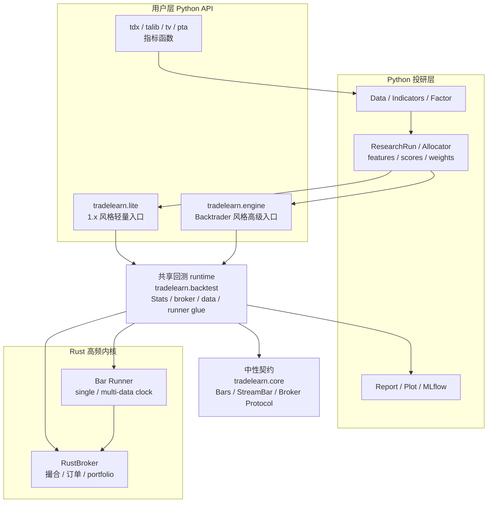

# trade-learn 技术手册

  

**trade-learn** 是一个面向指数增强、量化研究、机器学习策略和事件驱动回测的 Python / Rust 框架。Python 保留策略、因子、模型和研究流程的表达力；Rust 承担撮合、订单推进、bar runner 和 portfolio 计算这类高频回测内核。

> 当前手册面向 **trade-learn 2.0 架构**。Python wheel 版本为 **`0.2.0.0`**，承接历史 `0.1.1.8` demo 版本；文档里的 “1.x” 仅指历史参考或迁移语境，不代表当前 API 承诺。

## 核心能力

| 能力 | 说明 |
|---|---|
| Lite 轻量入口 | `tradelearn.lite` 写法短，适合快速验证、教学、1.x 风格迁移和多资产目标权重。 |
| Engine 高级入口 | `tradelearn.engine` 对齐 Backtrader 心智，适合复杂事件驱动策略、Analyzer、Sizer、Signal 和扩展组件。 |
| Rust 回测内核 | single-data runner 处理单标的数据流；multi-data runner 在同一交易日批量推进全部 active symbols，适合指数增强和组合调仓。 |
| 指标生态 | `tdx` / `talib` / `tv` / `pta` 明确选择口径，不把不同市场的指标语义混在一起。 |
| Research pipeline | `FeatureSet`、`Pipeline`、`CausalSelector`、`ResearchRun`、`Allocator` 串起训练 / 测试 / 预处理 / 评分 / 权重。 |
| 因子与报告 | alphalens / pyfolio 风格分析、HTML 报告、交互式 plot、CSV / XLSX artifacts。 |
| 实验追踪 | MLflow、JupyterLab、MCP 作为可选能力接入，不改变策略和回测主链。 |

## 入口选择

| 目标 | 推荐入口 | 说明 |
|---|---|---|
| 快速验证一个交易想法 | `tradelearn.lite` | `Backtest(data, Strategy).run()`，策略里直接 `buy()`、`position()`、`target_weights()`。 |
| 迁移或编写 Backtrader 风格策略 | `tradelearn.engine` | `Cerebro / Strategy / Analyzer / Sizer / Signal` 语义更完整。 |
| 做因子、预处理、训练测试切分 | `tradelearn.research` | 研究结果可以直接喂给 Lite 或 Engine 回测。 |
| 做指标口径对齐 | `tradelearn.tdx` / `tradelearn.talib` / `tradelearn.tv` / `tradelearn.pta` | 同一指标入口可用于 Lite 和 Engine 的 line 协议。 |
| 做报告和实验记录 | `tradelearn.report` / MLflow | `Stats` 是统一结果对象，report 与 artifacts 不区分 Lite / Engine 来源。 |

## 项目架构

这条分层的核心约束是：**用户入口只负责语法和工作流，业务状态留在 backtest runtime，高频状态推进留在 Rust，跨 backtest / paper / live 的公共语义才进入 core。**

## 设计目标

trade-learn 的目标不是再写一个只会跑单段回测的框架，而是把一条完整策略研发链路接起来。

  

上图每一段都对应当前代码中的一等组件：数据读取、指标和因子、探索 / 因果分析、模型、组合权重、事件驱动回测、报告和实验追踪。你可以只用其中一段，也可以把整条链路连成一个可复现实验。

## 一致性承诺

trade-learn 的正确性来自两层验证：

- **Engine 先对齐 Backtrader**：复杂事件驱动语义以 Backtrader 为 oracle，benchmark 会检查最终权益、交易明细、订单生命周期和 PnL。
- **Lite 复用同一 runtime**：Lite 不是另一套撮合；它只是更短的策略语法，底层 Stats、broker、runner 和 report 与 Engine 共用。

因此，Lite 适合快速写，Engine 适合专业扩展；二者不是两套回测世界。

## 先看什么

| 你想做什么 | 建议阅读 |
|---|---|
| 先跑起来 | [快速开始](quickstart.md) |
| 理解 Lite 和 Engine 的差异 | [策略撰写](guides/strategy.md) |
| 写 Lite 策略 | [Lite 入门](guides/lite.md) |
| 写 Backtrader 风格策略 | [Engine 入门](guides/engine.md) |
| 查看所有常用组件怎么调用 | [组件调用速查](guides/component-usage.md) |
| 写投研流水线 | [研究指南](guides/research.md) |
| 扩展指标 / Analyzer / 研究组件 | [扩展组件](guides/extensions.md) |
| 了解性能和对齐数据 | [性能基线](benchmarks.md) |
