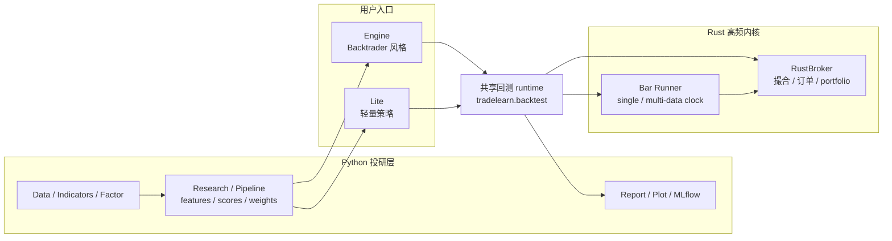

# 架构与边界

trade-learn 的结构分成三条线：用户写策略，Python 组织投研流程，Rust 承担高频回测内核。

## 分层原则

| 层 | 职责 | 不做什么 |
|---|---|---|
| `core` | 跨 backtest / paper / live 的中性契约 | 不放回测状态机、不放 facade 语义 |
| `backtest` | 公共回测 runtime、Rust broker、Stats、runner glue | 不作为用户主入口 |
| `engine` | Backtrader 风格高级 API | 不承载 runtime 细节 |
| `lite` | 轻量策略语法 | 不复制 Engine 的 Analyzer / Sizer / Signal 心智 |
| `research` / `factor` / `ml` | 投研、因子、机器学习组件 | 不直接控制 broker |
| `report` | 报告和图表 | 不参与撮合 |

## 运行原则

- Python 策略保持事件驱动写法。
- Rust 负责撮合、bar loop、订单推进和 portfolio。
- 指标不下沉 Rust，保持 TA-Lib、TDX、TradingView、pandas-ta-classic 等 Python 生态可核对。
- Engine 与 Lite 共用同一套 backtest runtime 和 Stats 口径。
- paper/live broker 通过事件契约扩展，不和 Rust 回测 broker 混成同一套实现。
