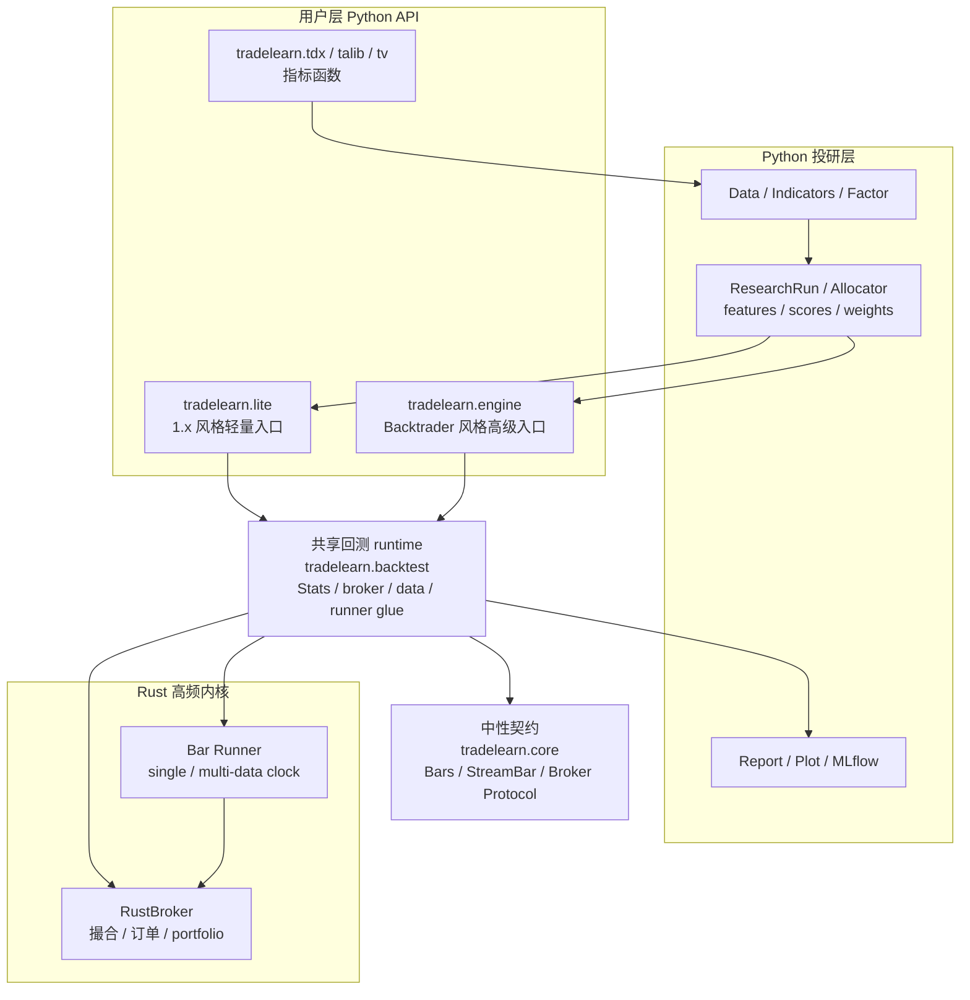

# 架构与边界

trade-learn 的结构分成三条清晰的线：用户写策略，Python 组织投研流程，Rust 承担高频回测内核。



## 用户入口

| 入口 | 适合谁 | 典型写法 |
|---|---|---|
| `tradelearn.lite` | 想快速验证想法、迁移 1.x 风格策略、写目标权重组合 | `tl.Backtest(bars, Strategy).run()` |
| `tradelearn.engine` | 熟悉 Backtrader、需要 Analyzer / Sizer / Signal / 多资产事件语义 | `bt.Cerebro(); cerebro.adddata(bars); cerebro.run()` |
| `tradelearn.research` | 做因子、预处理、选股、组合权重、实验追踪 | `ResearchRun` / `Allocator` / preprocess transformer |
| `tradelearn.report` | 从 Stats 或收益序列生成报告和图表 | `stats.report(...)` / `Reporter(...)` |

`tradelearn.backtest` 和 `tradelearn.core` 不是普通用户主入口。它们分别是回测运行时和跨 backtest / paper / live 的中性契约层。

## 分层原则

| 层 | 职责 | 不做什么 |
|---|---|---|
| `core` | 跨 backtest / paper / live 的中性契约 | 不放回测状态机、不放 facade 语义 |
| `backtest` | 公共回测 runtime、Rust broker、Stats、runner glue | 不作为用户主入口 |
| `engine` | Backtrader 风格高级 API | 不承载 runtime 细节 |
| `lite` | 轻量策略语法 | 不复制 Engine 的 Analyzer / Sizer / Signal 心智 |
| `research` / `factor` / `ml` | 投研、因子、机器学习组件 | 不直接控制 broker |
| `report` | 报告和图表 | 不参与撮合 |

## 关键数据流

```text
数据 -> 指标 / 因子 -> 预处理 -> 选股 / 权重 -> 事件驱动回测 -> Stats -> 报告 / MLflow
```

这条链路里每一段都是一等能力，不需要用户在框架外再拼 pyfolio / alphalens / empyrical / quantstats 的数据格式转换。

## 三条不可变量

1. **结果对齐优先**：Engine 的撮合结果必须持续对齐 Backtrader 语义，Lite 与 Engine 共用同一套 runtime 和 Stats 口径。
2. **策略 API 清晰优先**：性能优化不能把用户策略改成向量脚本，也不能牺牲事件驱动心智。
3. **实盘边界优先**：RustBroker 是回测实现；paper / live broker 通过 `core` 中性契约和事件泵接入，不和回测 broker 混成一套状态机。

## 运行原则

- Python 策略保持事件驱动写法。
- Rust 负责撮合、bar loop、订单推进和 portfolio。
- 指标不下沉 Rust，保持 TA-Lib、TDX、TradingView、pandas-ta-classic 等 Python 生态可核对。
- Engine 与 Lite 共用同一套 backtest runtime 和 Stats 口径。
- paper/live broker 通过事件契约扩展，不和 Rust 回测 broker 混成同一套实现。

## 配置与环境变量

常用环境变量集中在运行边界，不写进策略类：

| 变量 | 用途 |
|---|---|
| `MLFLOW_TRACKING_URI` | MLflow tracking server 地址 |
| `TRADELEARN_DATA_CACHE_DIR` | 数据缓存目录 |
| `TRADELEARN_LOG_LEVEL` | 日志等级 |
| `TRADELEARN_SEED` | 研究或示例里的随机种子 |

## 明确不做

- 不把指标计算下沉到 Rust。
- 不在 `core` 放 Backtrader / Lite 专属 API。
- 不把 QMT / IB / CTP 等实盘适配器和 Rust 回测 broker 混成同一个实现。
- 不在 1.0 把 Web UI / HTTP 服务端作为核心能力。
