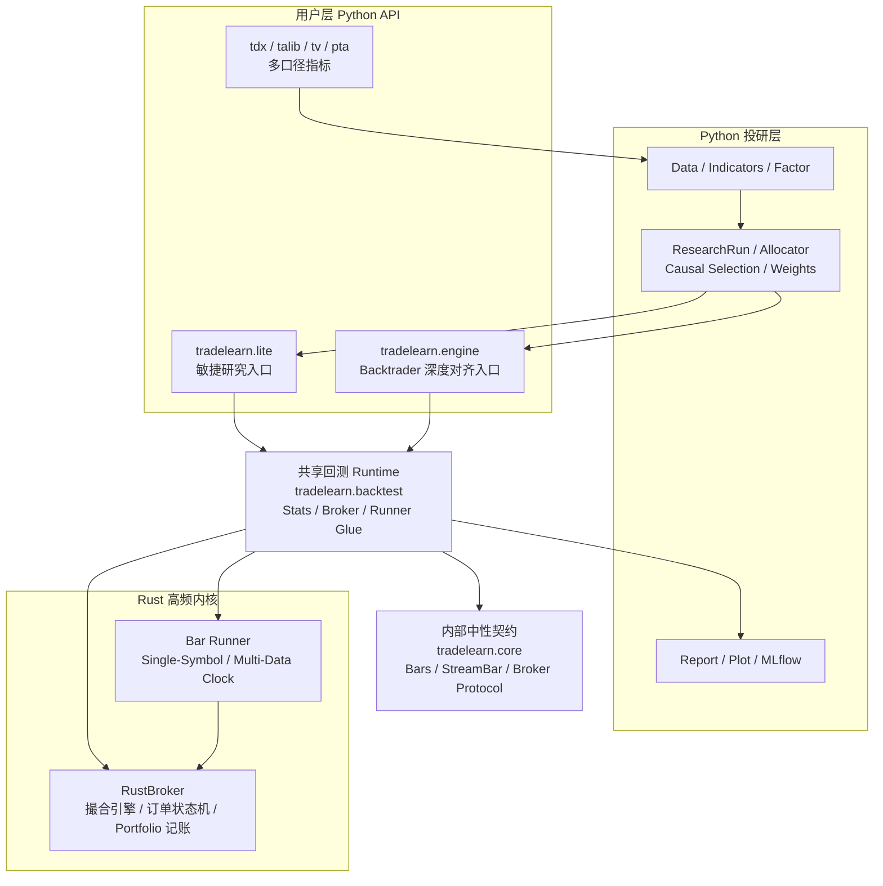

# 架构与边界

`trade-learn` 的设计核心是 **“语法分层，内核收敛”**。它在用户侧提供两套互补的 API，但在底层通过统一的高性能回测 Runtime 实现决策执行。

---

## 全景架构图

---

## 权力边界：Python vs Rust

为了在灵活性和性能之间取得平衡，`trade-learn` 对每一层的职责有着严格的界定：

| 维度 | Python 层 (策略与投研) | Rust 层 (高性能内核) |
|---|---|---|
| **核心职责** | 策略表达、因子研究、模型训练、报告生成 | 事件循环调度、订单撮合、持仓刷新、盈亏计算 |
| **数据拥有权** | 拥有 **指标 (Indicators)** 和 **策略状态** | 拥有 **订单队列** 和 **Portfolio 总账** |
| **性能关键** | 指标计算批量化 (Vectorized) | 撮合与账户刷新指令化 (Event-driven) |
| **交互媒介** | 策略回调 (`next`, `notify_*`) | Apache Arrow 零拷贝数据交换 |

---

## 设计哲学：三条铁律

!!! important
    ### 1. 结果对齐优先 (Oracle Consistency)
    `engine` 模式以 Backtrader 为金标 Oracle。任何 API 的引入或性能优化，都不能以牺牲与基线的数值对齐为代价。

    ### 2. 模式共生 (Dual-Mode Parity)
    `lite` 并非 `engine` 的子集，而是另一种工作流。两者必须共享同一套底层 Runtime 和 `Stats` 结果集，确保同一策略在两套语法下结果完全一致。

    ### 3. 生产语义导向 (Production-Ready)
    回测逻辑必须能够映射到生产环境，但不能假设成交语义完全相同。RustBroker 仅用于回测，实盘适配器通过内部 `core` 定义的中性协议对接，确保回测与实盘共享同一套策略意图、数据契约和订单事件边界。

---

## 运行时原则 (Runtime Principles)

- **确定性执行**：回测过程必须是 100% 可复现的单线程同步执行（除非显式开启分布式寻优）。
- **指标不下沉**：为了保持与 TA-Lib/TDX 等成熟生态的口径对齐，指标计算保持在 Python 层，通过共享内存与 Rust 核通信。
- **懒加载与预计算**：行情数据通过 Arrow 预加载至 Rust 侧内存，策略执行过程中 Rust 侧不再触发外部 IO。

---

## 相关阅读
- [快速开始](../quickstart.md)：3 分钟跑通第一个策略。
- [API 边界](api-boundary.md)：公开 facade 与内部实现层的划分。
- [Runtime 与 Runner](runtime.md)：了解 Rust 是如何调度计算任务的。
- [契约与边界](../internals/contracts.md)：深入 Bar、Order、Fill 的字段定义。
