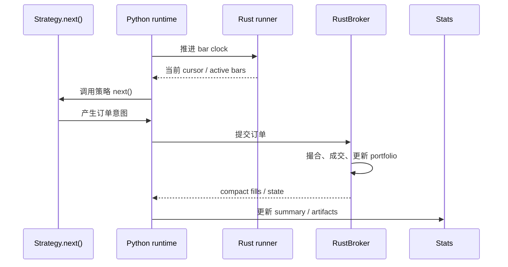

# Runtime 与 Runner

trade-learn 是事件驱动回测框架，不是纯向量化回测器。策略仍然在每根 bar 上通过 `next()` 表达逻辑，runtime 负责把当前 bar、订单、成交、持仓和权益状态推进下去。

## 自动 runner 选择

| 场景 | 自动路径 | 触发条件 |
|---|---|---|
| 单标的 | Rust single-data runner | `RustBroker` 已绑定 Rust engine，且只有 1 个 data feed |
| 多标的 | Rust multi-data clock runner | `len(datas) > 1`，每个 feed 暴露 OHLCV 数组 |
| 自定义 feed / 非 Rust broker | Python fallback | 不满足数组协议或 broker 条件 |

用户不需要显式选择 runner。Engine 和 Lite 都通过 `tradelearn.backtest` runtime 进入同一套内核。

触发条件的具体口径：

- **single-data runner**：只有一个数据源时使用。它保留单标的最短路径，不引入多标的 active symbol、clock plan 或 cross-section 组装开销。
- **Rust clocked multi-data runner**：两个及以上数据源时优先使用。数据源必须由标准 OHLCV `DataFeed` / panel 自动拆分得到，并暴露连续的 `datetime/open/high/low/close/volume` 数组；这类数据会按主时钟推进，每个时点只激活有 bar 的 symbols。
- **Python fallback runtime**：如果 broker 不是 `RustBroker`、data feed 不满足数组协议、用户提供了非标准自定义 feed，或后续 live/paper adapter 明确要求事件逐条回放，则回退 Python runtime。回退不会改变策略 API，只是吞吐会低于 Rust runner。

这个选择逻辑对 Engine 和 Lite 一致：`bt.Cerebro().adddata(panel)` 与 `tl.Backtest(panel, Strategy)` 只要输入 schema 满足条件，都会进入同一套多标的 Rust runner。

## 事件顺序

## 为什么不是纯向量化

纯向量化可以很快，但会弱化订单生命周期、成交事件、拒单、撤单、现金和持仓状态回流。trade-learn 保留事件驱动模型，是为了让回测策略更容易迁移到 paper/live broker，同时把真正高频的撮合和状态推进放进 Rust。
