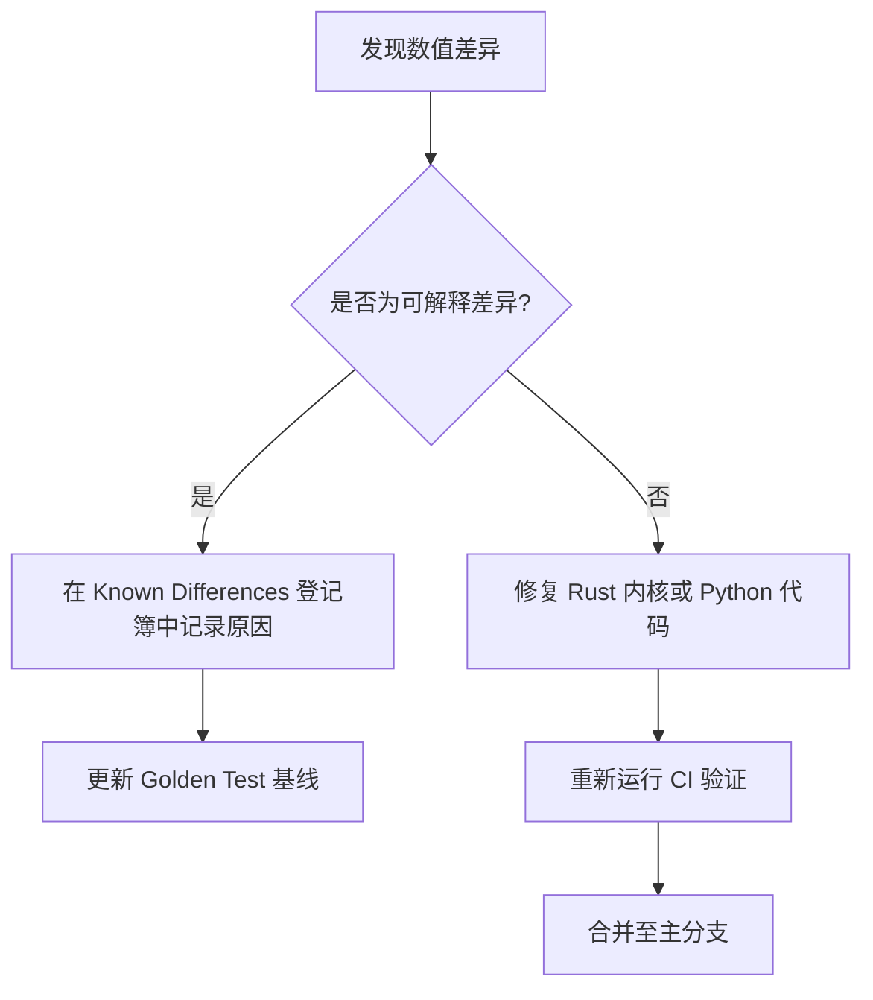

# 与外部库的语义一致性

`trade-learn` 将 **“可对照、可复现”** 视为核心生命线。我们深知，如果一个回测框架的数值无法与行业公认的 Oracle 对齐，那么它产生的任何 Alpha 都没有研究价值。

---

## 我们的承诺：误差分级制度

我们为框架的每一层都设定了严格的数值对齐指标，所有偏差必须在 `Golden Test` 集中通过验证。

| 层级 | 对齐目标 (Oracle) | 容忍度 (Tolerance) | 技术说明 |
|---|---|---|---|
| **核心指标 (Metrics)** | empyrical / pyfolio / alphalens | `rtol=1e-10` | 纯数学计算，要求零误差 |
| **标准指标 (tl.pta)** | pandas-ta-classic | `rtol=1e-10` | 算法口径完全一致 |
| **A 股口径 (tl.tdx)** | MyTT / 通达信软件 | `rtol=1e-10` | 针对 A 股修正的平滑系数对齐 |
| **海外口径 (tl.tv)** | pyneCore / TradingView | `rtol=1e-6` | 由于 TV 内部闭源算法，允许微小浮点偏差 |
| **决策执行 (Trades)** | **Backtrader (Oracle)** | **0 差异** | 时间、方向、Size 必须完美吻合 |
| **账户净值 (Equity)** | Backtrader (Oracle) | `rtol=1e-6` | 允许由于撮合引擎精度产生的累积差 |
---

## 0 差异决策对齐：Golden Test 机制

为了确保 `engine` 模式在逻辑上完全等价于 Backtrader，我们维护了一个 **Golden Test 集**（位于 `tests/golden/`）：

1.  **策略样本**：包含双均线、RSI 逆势、海龟法则、组合调仓等 10+ 个标准策略。
2.  **对照执行**：每一版代码提交前，CI 都会在同一组行情数据上同时运行 `trade-learn` 和 `Backtrader`。
3.  **逐单审计**：系统会对产生的 `Trade` 序列进行逐行扫描，任何一笔订单的时间、价格、手续费如果不匹配，CI 将被强制阻断。

---

## 偏差处理流程 (Divergence Loop)

!!! note
    **未登记的差异 = Bug**
    任何超出容忍度的差异，开发者必须遵循以下流程：

### 什么是“可解释差异”？
- **浮点数累加顺序**：Rust 侧向量化计算与 Python 侧逐行累加可能导致末位精度不同。
- **佣金计算舍入**：不同券商口径对 0.5 元以下佣金的取整规则差异。
- **指标暖机期**：个别第三方指标库在第 0 根 Bar 的初始值处理逻辑与标准库不同。

---

## 如何查看差异登记？

任何已被接受的逻辑微差都公开记录在 [版本迁移登记簿](migration.md) 中。我们鼓励用户对比这些差异，确保回测结果的透明度。

---

## 相关阅读
- [性能基线](../benchmarks.md)：查看我们在正确性前提下实现的加速比。
- [撮合与成交](matching.md)：深入了解 0 差异决策背后的物理撮合规则。
- [Portfolio 模型](portfolio.md)：了解账户记账与 Backtrader 的细微差别。
