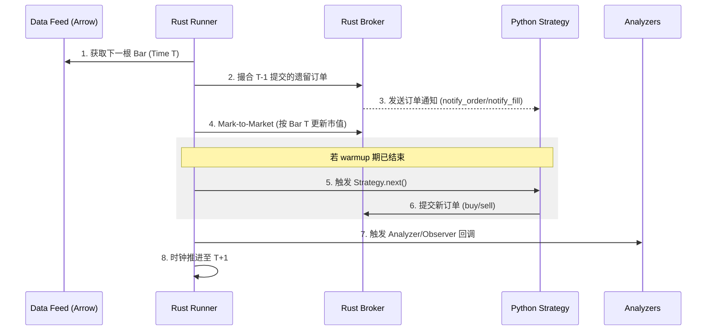

# 事件循环 (Event Loop)

`trade-learn` 采用确定性的 **“单事件推进”** 模型。本页详细描述一根 Bar 从进入内核到触发策略回调，再到最终订单执行的完整生命周期。

---

## 核心时序图 (The Lifecycle)

下图展示了在每一根 Bar 推进时，系统内部各组件的交互顺序：

---

## 步骤深度解析

### 1. 撮合优先 (Matching First)
当新 Bar 到达时，引擎执行的第一项操作是**撮合上一根 Bar 的遗留订单**。
- 这意味着你在 `next()` 中看到的 `self.position` 已经包含了刚刚成交的订单结果。
- 这种逻辑确保了回测过程严格遵循“决策 -> 成交 -> 观察结果”的闭环，消除了“偷看未来”的可能性。

### 2. 成交时点：`trade_on_close` 的差异
这是项目中最关键的撮合开关，直接决定了策略的成交属性：

| 模式 | 成交 Bar | 成交价 | 适用场景 |
|---|---|---|---|
| **默认 (False)** | 下一根 Bar | **Open** | 模拟次日开盘下单（最稳健/工业标准） |
| **trade_on_close=True** | 当前 Bar | **Close** | 模拟收盘竞价成交（投研流水线常用） |

!!! warning
    开启 `trade_on_close=True` 时，务必确保你的决策信号不是直接基于当前 Bar 的 Close 衍生出的极短线指标（如：当日涨幅 > 9% 下单），否则会引入潜在的先验偏差。

### 3. 多数据源对齐 (Multi-Data Alignment)
在处理多资产组合（如标的 A 和标的 B 时间戳不完全一致）时，`trade-learn` 遵循 **Primary-Clock (主时钟)** 机制：
- **主数据源**：`datas[0]` 决定了 `next()` 触发的频率。
- **最新可见原则 (Latest-at-or-before)**：当主时钟走到时间 $T$ 时，副数据源通过 Line 协议返回其在 $T$ 时刻或 $T$ 之前最新的那一根 Bar。
- **防止窥视**：绝不会返回 $T$ 之后的数据。

### 4. 批处理模式 (`callback_batch`)
对于机器学习大规模回测，可以将 `callback_batch` 设置为 $N$：
- 引擎会静默推进 $N$ 根 Bar 并在内存中累积。
- 到达第 $N$ 根 Bar 时，一次性触发 `next()`。
- **注意**：这会引入 $N$ 个 Bar 的撮合延迟，主要用于特定周期的高频因子验证场景。

---

## Python ↔ Rust 数据交互

由于回测内核在 Rust 侧，系统通过 **Apache Arrow** 实现高效的跨语言通信：
- **行情数据**：一次性通过 Zero-copy 传递给 Rust。
- **订单/持仓**：通过 FFI 暴露精简的 C-接口，确保 Python 侧访问 `self.position` 时几乎无开销。

!!! warning
    **不要在 `next()` 之外维护持久化持仓状态**
    Rust 内核拥有持仓的总账权。Python 侧的 `self.position` 是一个实时投影，任何不通过 `buy/sell/close` 接口而试图修改持仓的行为都会导致严重的账实不符。

---

## 相关阅读
- [撮合与成交](matching.md)：深入探讨撮合引擎的微观规则。
- [Portfolio 模型](portfolio.md)：了解市值计算与账户刷新逻辑。
- [设计哲学 - 与外部库一致性](consistency.md)：为何我们要对齐 Backtrader。
